# 開発工程別ツールマップ（Mermaid）

各 `docs/dev_process_開発工程_xx_*.md` の `##` セクションをレイヤーとして可視化したマップです。  
工程内で複数セクションに登場するツールは、最上部の「Common tools」レイヤーにまとめ、各セクション側では重複を除外しています。

各工程を個別のMermaidブロックに分割し、レンダラーでのエラーを避けています。

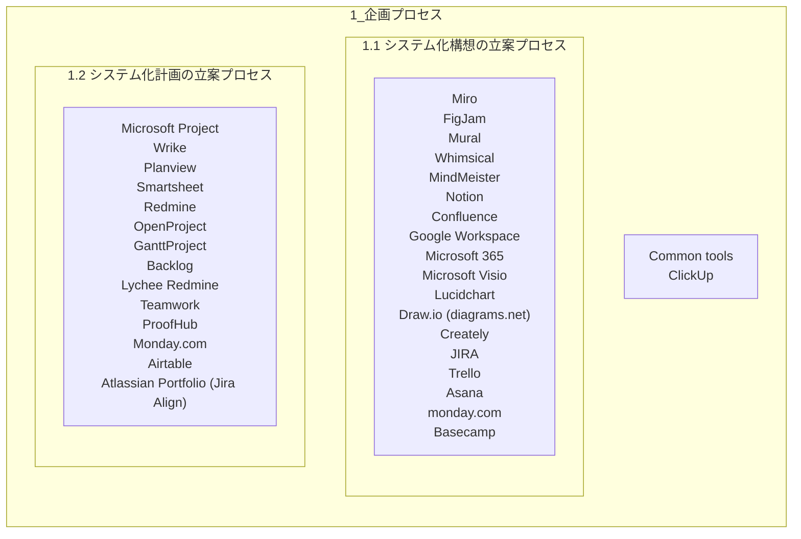

```mermaid
%%{init: {'flowchart': {'htmlLabels': true}}}%%
flowchart TB
    subgraph P2[2_要件定義]
        direction TB
        P2_common["Common tools<br/>Confluence<br/>Figma<br/>Adobe XD<br/>Sketch<br/>Balsamiq<br/>Axure RP<br/>Jama Connect<br/>Lucidchart<br/>Microsoft Visio<br/>Draw.io (diagrams.net)<br/>Enterprise Architect<br/>Microsoft Excel<br/>Notion"]
        subgraph P2s1[1. 概要]
            direction TB
            P2s1_t["ONES Wiki<br/>GEAR.indigo<br/>VISLITE"]
        end
        subgraph P2s2[2. 業務分析]
            direction TB
            P2s2_t["Bizagi Modeler<br/>Process Street"]
        end
        subgraph P2s3[3. ユースケース分析（機能要件定義）]
            direction TB
            P2s3_t["Visual Paradigm<br/>PlantUML"]
        end
        subgraph P2s4[5. 帳票要件定義（機能要件定義）]
            direction TB
            P2s4_t["Crystal Reports<br/>Jaspersoft Studio<br/>BIRT (Business Intelligence and Reporting Tools)<br/>LibreOffice Calc"]
        end
        subgraph P2s5[6. ファイル要件定義（機能要件定義）]
            direction TB
            P2s5_t["CSV Spec Validator"]
        end
        subgraph P2s6[7. 概念モデリング（機能要件定義）]
            direction TB
            P2s6_t["ERDPlus<br/>MySQL Workbench<br/>pgModeler"]
        end
        subgraph P2s7[8. 外部システム連携要件定義（機能要件定義）]
            direction TB
            P2s7_t["Postman<br/>Swagger/OpenAPI"]
        end
        subgraph P2s8[9. バッチ処理要件定義（機能要件定義）]
            direction TB
            P2s8_t["JP1/AJS (Hitachi)"]
        end
        subgraph P2s9[10. システム方針検討（機能要件定義）]
            direction TB
            P2s9_t["C4 Model + PlantUML"]
        end
        subgraph P2s10[11. 非機能要件定義]
            direction TB
            P2s10_t["IPA 非機能要求グレード利用ガイド（Excel版）<br/>Microsoft Excel / Google Sheets"]
        end
    end
```

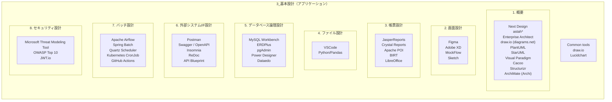

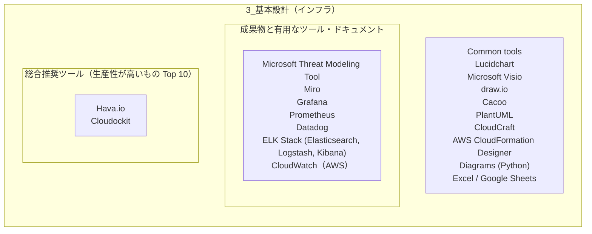

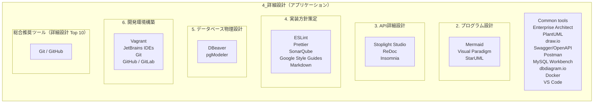

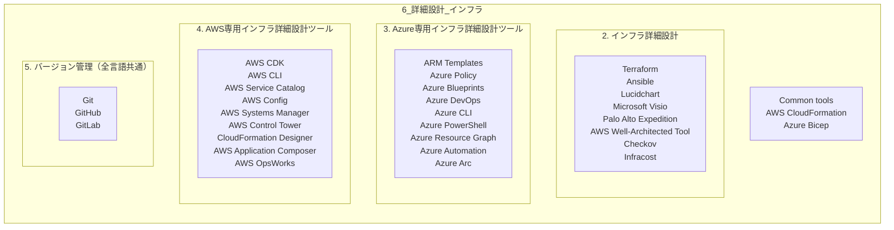

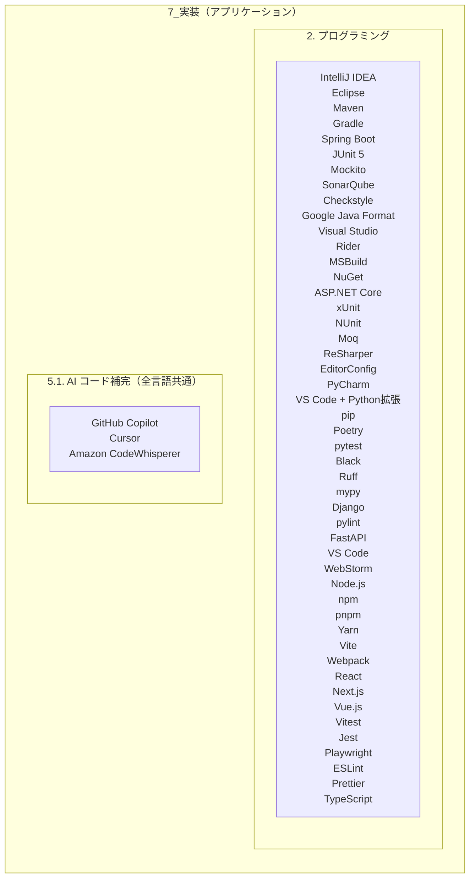

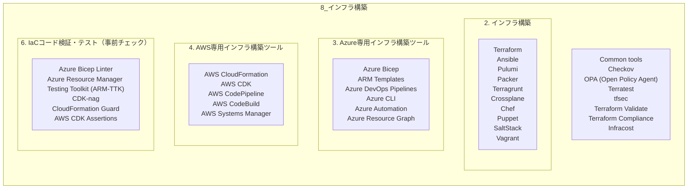

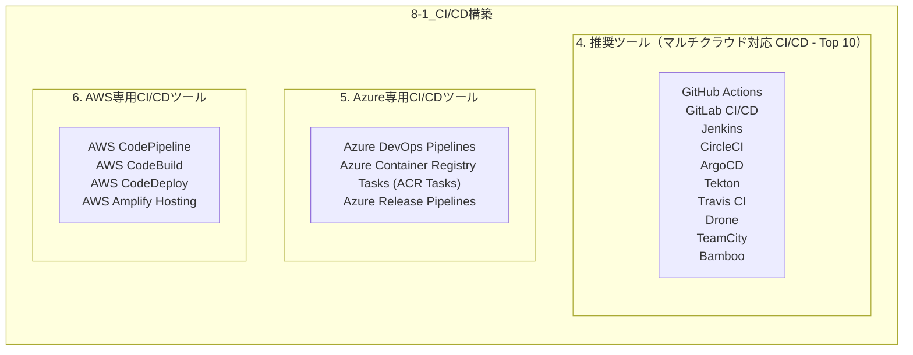

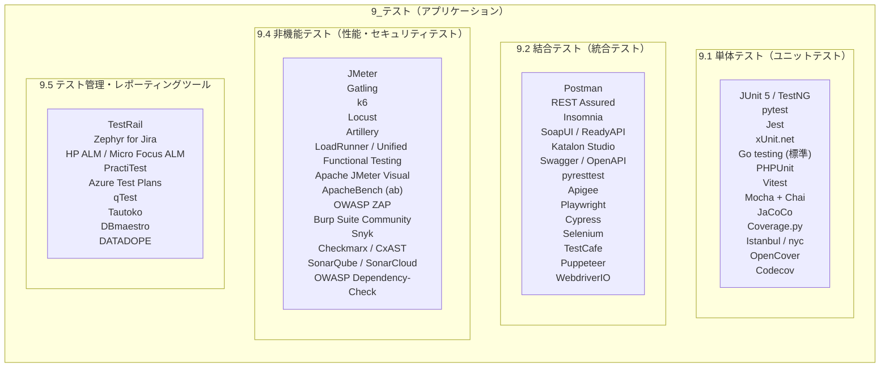

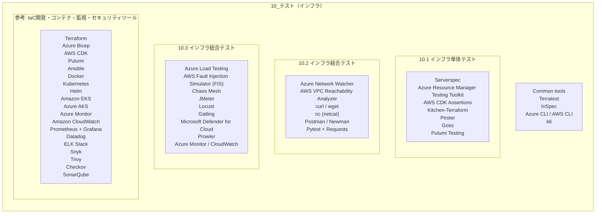

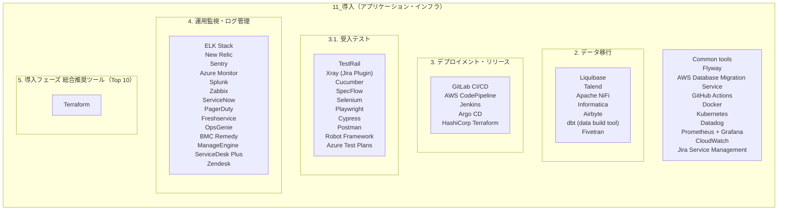

> 図は既存ドキュメントをスキャンして自動生成しています。セクションやツールを追加・変更した場合は、このファイルを再生成してください（現状スクリプトはリポジトリ未同梱）。
