# 開発工程_8-1_CI/CD構築

## 1. 概要

本ドキュメントは、IPA（独立行政法人 情報処理推進機構）の「共通フレーム2013」に基づく**CI/CD（Continuous Integration / Continuous Delivery）構築プロセス**における開発タスクと推奨ツールをまとめたものです。

CI/CDでは、[開発工程_8_インフラ構築](./dev_process_開発工程_8_インフラ構築.md) によって構築されたインフラストラクチャ上で[開発工程_7_実装_アプリケーション](./dev_process_開発工程_7_実装_アプリケーション.md) によって実装されたアプリケーションを自動ビルド・テスト・デプロイします。

## 2. CI/CDとは

### 2.1 CI (Continuous Integration) - 継続的インテグレーション

コードの変更を頻繁にメインブランチに統合し、自動ビルド・自動テストを実行することで、品質を維持しながら開発速度を向上させる手法です。

### 2.2 CD (Continuous Delivery / Deployment) - 継続的デリバリー/デプロイ

- **Continuous Delivery（継続的デリバリー）**: 本番環境へのリリースをいつでも実行できる状態を維持
- **Continuous Deployment（継続的デプロイ）**: テストを通過したコードを自動的に本番環境へデプロイ

## 3. CI/CD構築

### 3.1. 主要タスク

- **ソースコード管理**: Git、GitHub、GitLab等でのバージョン管理
- **自動ビルド**: コミット/プルリクエスト時の自動ビルド実行
- **自動テスト**: 単体テスト、結合テスト、E2Eテストの自動実行
- **静的解析**: コード品質チェック、セキュリティスキャン
- **アーティファクト管理**: ビルド成果物の保管・バージョン管理
- **自動デプロイ**: ステージング・本番環境への自動デプロイ
- **環境管理**: 開発・ステージング・本番環境の管理
- **ロールバック**: デプロイ失敗時の自動ロールバック
- **通知・レポート**: ビルド/デプロイ結果の通知

### 3.2. 対応項目

- IaCコード構文チェック
- セキュリティポリシー検証
- ベストプラクティス準拠チェック
- アプリケーションコード構文チェック
- セキュリティスキャン
- ポリシー準拠チェック

### 3.3. 成果物

- CI/CDパイプライン定義ファイル
- ビルド・テストレポート
- セキュリティスキャン結果
- デプロイ履歴・ログ
- パフォーマンスメトリクス

## 4. 推奨ツール（マルチクラウド対応 CI/CD - Top 10）

**注**: Azure専用ツールは「Azure専用CI/CDツール」、AWS専用ツールは「AWS専用CI/CDツール」セクションを参照してください。

| # | ツール名 | 概要 | 用途 | 料金 | メリット | デメリット |
|---|---------|------|------|------|---------|-----------|
| 1 | [**GitHub Actions**](https://github.com/features/actions) | GitHub統合CI/CD。YAML定義、豊富なマーケットプレイス | CI/CD、自動ビルド・テスト・デプロイ、GitHubワークフロー自動化 | 🟢 パブリックリポジトリ無料 / 💰 プライベート月2000分無料、超過従量課金 | ✅ GitHub完全統合<br>✅ マーケットプレイス豊富<br>✅ YAML記述シンプル<br>✅ マルチクラウド対応<br>✅ セルフホストランナー | ❌ GitHub依存<br>❌ 複雑なワークフロー困難<br>❌ デバッグやや困難<br>❌ 実行時間制限あり |
| 2 | [**GitLab CI/CD**](https://docs.gitlab.com/ee/ci/) | GitLab統合CI/CD。.gitlab-ci.yml、Auto DevOps | CI/CD、自動ビルド・テスト・デプロイ、GitLabワークフロー | 🟢 Free版あり / 💰 Premium/Ultimate有料 | ✅ GitLab完全統合<br>✅ Auto DevOps<br>✅ コンテナレジストリ統合<br>✅ Kubernetesデプロイ容易<br>✅ セルフホスト可能 | ❌ GitLab依存<br>❌ 設定複雑化しやすい<br>❌ リソース使用量大<br>❌ 学習曲線やや急 |
| 3 | [**Jenkins**](https://www.jenkins.io/) | オープンソースCI/CD。プラグイン豊富、高カスタマイズ性 | CI/CD、自動ビルド・テスト・デプロイ、複雑なパイプライン | 🟢 完全無料(オープンソース) | ✅ 高カスタマイズ性<br>✅ プラグイン超豊富<br>✅ セルフホスト<br>✅ 実績豊富<br>✅ コミュニティ大きい | ❌ セットアップ複雑<br>❌ UI古い<br>❌ 保守運用コスト高<br>❌ セキュリティ管理必要 |
| 4 | [**CircleCI**](https://circleci.com/) | クラウドCI/CD。高速実行、Docker/Kubernetes対応 | CI/CD、自動ビルド・テスト、コンテナビルド | 🟢 Free版(月6000分) / 💰 Performance/Scale有料 | ✅ 高速実行<br>✅ Docker/K8s統合<br>✅ 並列実行<br>✅ キャッシュ優秀<br>✅ YAML記述 | ❌ 無料枠少ない<br>❌ 有料版高額<br>❌ セルフホスト不可(Free)<br>❌ 複雑な設定困難 |
| 5 | [**ArgoCD**](https://argo-cd.readthedocs.io/) | KubernetesネイティブCD。GitOps、宣言的デプロイ | Kubernetes GitOps、自動同期、マニフェスト管理 | 🟢 完全無料(オープンソース) | ✅ GitOps標準<br>✅ Kubernetes完全統合<br>✅ 宣言的管理<br>✅ 差分可視化<br>✅ マルチクラスタ対応 | ❌ Kubernetes必須<br>❌ 学習曲線急<br>❌ CI機能なし(CD専用)<br>❌ セットアップ必要 |
| 6 | [**Tekton**](https://tekton.dev/) | KubernetesネイティブCI/CD。Cloud Native、CRD定義 | Kubernetes CI/CD、パイプライン、Cloud Nativeビルド | 🟢 完全無料(オープンソース) | ✅ Cloud Native<br>✅ Kubernetesネイティブ<br>✅ 再利用可能コンポーネント<br>✅ ベンダーニュートラル<br>✅ CNCF卒業プロジェクト | ❌ Kubernetes必須<br>❌ 学習曲線非常に急<br>❌ UI基本的(Dashboardは別)<br>❌ 複雑なYAML |
| 7 | [**Travis CI**](https://www.travis-ci.com/) | クラウドCI/CD。.travis.yml、GitHub統合 | CI/CD、自動ビルド・テスト、オープンソースプロジェクト | 🟢 OSS無料 / 💰 有料プラン | ✅ GitHub統合<br>✅ シンプル設定<br>✅ OSS無料<br>✅ マルチプラットフォーム<br>✅ マトリクスビルド | ❌ 有料版高額<br>❌ 実行速度やや遅い<br>❌ GitHub Actions台頭<br>❌ 機能限定的 |
| 8 | [**Drone**](https://www.drone.io/) | コンテナネイティブCI/CD。Docker Pipeline、プラグイン | CI/CD、Dockerビルド、軽量パイプライン | 🟢 オープンソース版無料 / 💰 Enterprise有料 | ✅ 軽量・高速<br>✅ コンテナネイティブ<br>✅ シンプル設定<br>✅ セルフホスト容易<br>✅ 多Git統合 | ❌ プラグイン少ない<br>❌ コミュニティ小<br>❌ ドキュメントやや少ない<br>❌ UI基本的 |
| 9 | [**TeamCity**](https://www.jetbrains.com/teamcity/) | JetBrains製CI/CD。強力UI、複雑ビルド対応 | CI/CD、エンタープライズビルド、複雑パイプライン | 🟢 Free版(3 agents, 100 builds) / 💰 Professional/Enterprise有料 | ✅ 強力なUI<br>✅ ビルド連鎖<br>✅ 多言語対応<br>✅ IDE統合(JetBrains)<br>✅ セルフホスト | ❌ 無料版制限強い<br>❌ 有料版高額<br>❌ リソース使用量大<br>❌ セットアップ複雑 |
| 10 | [**Bamboo**](https://www.atlassian.com/software/bamboo) | Atlassian製CI/CD。Jira/Bitbucket統合 | CI/CD、Atlassianエコシステム、ビルド・デプロイ | 💰 有料(Server/Data Center) / 🟢 10 jobs無料 | ✅ Jira完全統合<br>✅ Bitbucket統合<br>✅ 並列ビルド<br>✅ デプロイプロジェクト<br>✅ エンタープライズ向け | ❌ 有料のみ<br>❌ 高額<br>❌ セットアップ複雑<br>❌ GitHub Actions比で柔軟性低い |

---

## 5. Azure専用CI/CDツール

Azureエコシステムに最適化されたCI/CDツール群です。

### 5.1 Azure CI/CDツール（Top 3）

| # | ツール名 | 概要 | 用途 | 料金 | メリット | デメリット |
|---|---------|------|------|------|---------|-----------|
| 1 | [**Azure DevOps Pipelines**](https://azure.microsoft.com/ja-jp/products/devops/pipelines/) | Azure統合CI/CD。YAML Pipeline、マルチプラットフォーム | CI/CD、ビルド・テスト・デプロイ、Infrastructure Pipeline | 🟢 月1800分無料 / 💰 超過従量課金 | ✅ Azure完全統合<br>✅ YAML Pipeline<br>✅ 並列ジョブ<br>✅ マルチプラットフォーム<br>✅ セルフホストエージェント | ❌ 設定複雑<br>❌ デバッグ困難<br>❌ GitHub Actions比で情報少ない<br>❌ Azure依存 |
| 2 | [**Azure Container Registry Tasks (ACR Tasks)**](https://learn.microsoft.com/azure/container-registry/container-registry-tasks-overview) | ACR統合ビルド。コンテナイメージ自動ビルド | コンテナイメージビルド、マルチステップタスク、自動ビルド | 🟢 使用量課金 | ✅ ACR統合<br>✅ コンテナビルド特化<br>✅ トリガー豊富<br>✅ マルチステップタスク<br>✅ クロスリージョンビルド | ❌ コンテナ専用<br>❌ 複雑なパイプライン困難<br>❌ 他CI/CD比で機能少ない<br>❌ Azure専用 |
| 3 | [**Azure Release Pipelines**](https://learn.microsoft.com/azure/devops/pipelines/release/) | Azure DevOpsリリース管理。承認ゲート、ステージ管理 | リリース管理、承認フロー、ステージ別デプロイ | 🟢 Azure DevOps料金に含む | ✅ 視覚的パイプライン<br>✅ 承認ゲート<br>✅ ステージ管理<br>✅ ロールバック機能<br>✅ Azure統合 | ❌ YAML Pipelineで代替推奨<br>❌ Classic Pipelines(旧世代)<br>❌ 学習コスト高<br>❌ 柔軟性低い |

---

## 6. AWS専用CI/CDツール

AWSエコシステムに最適化されたCI/CDツール群です。

### 6.1 AWS CI/CDツール（Top 4）

| # | ツール名 | 概要 | 用途 | 料金 | メリット | デメリット |
|---|---------|------|------|------|---------|-----------|
| 1 | [**AWS CodePipeline**](https://aws.amazon.com/codepipeline/) | AWSネイティブCI/CD。視覚的パイプライン、AWSサービス統合 | CI/CD、パイプライン管理、自動デプロイ | 🟢 月1パイプライン無料 / 💰 超過$1/pipeline/月 | ✅ AWSサービス完全統合<br>✅ 視覚的パイプライン<br>✅ 並列・連続実行<br>✅ サードパーティ統合<br>✅ CloudWatch統合 | ❌ 設定複雑<br>❌ AWS依存<br>❌ デバッグ困難<br>❌ パイプライン課金 |
| 2 | [**AWS CodeBuild**](https://aws.amazon.com/codebuild/) | フルマネージドビルドサービス。スケーラブル、Docker対応 | CI、ビルド、Dockerイメージビルド、テスト実行 | 🟢 月100分無料 / 💰 超過従量課金(ビルド分数) | ✅ フルマネージド<br>✅ スケーラブル<br>✅ Docker対応<br>✅ 並列ビルド<br>✅ カスタムビルド環境 | ❌ 設定複雑<br>❌ デバッグ困難<br>❌ コスト予測難しい<br>❌ ローカル実行困難 |
| 3 | [**AWS CodeDeploy**](https://aws.amazon.com/codedeploy/) | デプロイ自動化サービス。ローリング更新、Blue/Green | アプリケーションデプロイ、EC2/Lambda/ECS自動デプロイ | 🟢 EC2/Lambda無料 / 💰 ECS/Fargate有料 | ✅ 多様なデプロイ戦略<br>✅ ロールバック自動<br>✅ Blue/Greenデプロイ<br>✅ モニタリング統合<br>✅ オンプレ対応 | ❌ 設定複雑<br>❌ AppSpec学習必要<br>❌ ECS/Fargate有料<br>❌ トラブルシューティング困難 |
| 4 | [**AWS Amplify Hosting**](https://aws.amazon.com/amplify/hosting/) | フロントエンド特化CI/CD。Git連携、SSR対応 | フロントエンドCI/CD、Webホスティング、SSR/SSGビルド | 🟢 月1000分無料 / 💰 超過従量課金 | ✅ フロントエンド特化<br>✅ Git統合<br>✅ プレビュー環境自動<br>✅ SSR/SSG対応<br>✅ CDN統合 | ❌ フロントエンド専用<br>❌ カスタマイズ性低い<br>❌ ビルド時間長い場合あり<br>❌ 複雑な設定困難 |

---

## 7. CI/CDベストプラクティス

### 7.1 パイプライン設計

効率的で保守性の高いCI/CDパイプラインを構築するための設計原則とパターンを説明します。

#### 7.1.1 基本パイプライン構造

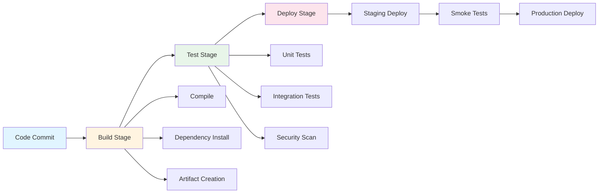

**ステージ分離の原則**:
- **Build**: ソースコードのコンパイル、依存関係のインストール、アーティファクト作成
- **Test**: 単体テスト、結合テスト、セキュリティスキャンの実行
- **Deploy**: ステージング環境への展開、スモークテスト、本番環境への展開

各ステージを明確に分離することで、問題の早期発見と迅速なトラブルシューティングが可能になります。

#### 7.1.2 並列実行パターン

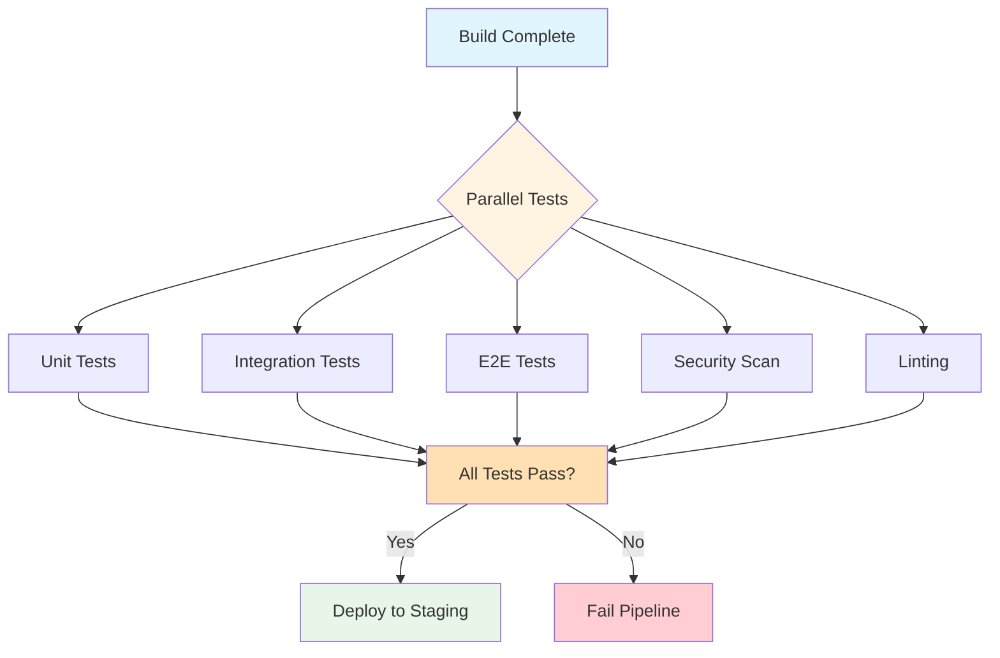

**並列実行のメリット**:
- テスト実行時間の短縮（5つのテストを並列実行で1/5に）
- フィードバックサイクルの高速化
- 開発者の待ち時間削減

**実装例**:
```yaml
# GitHub Actions の例
jobs:
  test:
    strategy:
      matrix:
        test-type: [unit, integration, e2e, security, lint]
    runs-on: ubuntu-latest
    steps:
      - name: Run ${{ matrix.test-type }} tests
        run: npm run test:${{ matrix.test-type }}
```

#### 7.1.3 キャッシュ戦略

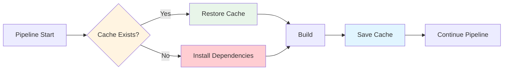

**キャッシュ対象**:
- 依存関係（node_modules、pip packages、Maven/Gradle cache）
- ビルド成果物（コンパイル済みファイル）
- Dockerレイヤー
- テストデータ

**効果**:
- パイプライン実行時間を30-70%短縮
- ネットワーク帯域幅の削減
- 外部依存関係のダウンロード失敗リスク軽減

#### 7.1.4 失敗時の早期停止

- **エラー検出時は即座にパイプライン停止**: 後続ステージの無駄な実行を防止
- **Fail-fast戦略**: 最初のエラーで即座に終了し、開発者に迅速なフィードバック
- **タイムアウト設定**: 無限ループや長時間実行の防止（通常15-30分）

### 7.2 セキュリティ

CI/CDパイプラインにおけるセキュリティは、アプリケーション全体のセキュリティの基盤となります。

#### 7.2.1 セキュリティ統合アーキテクチャ

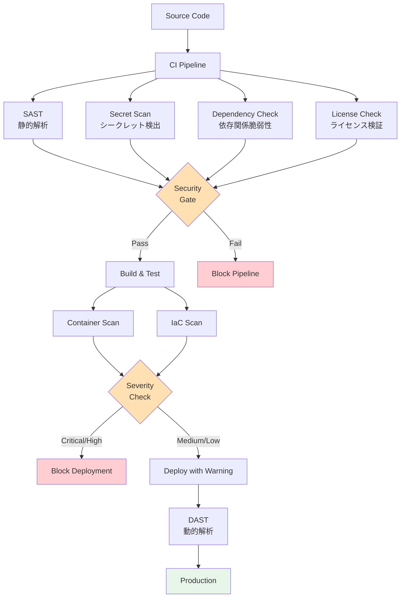

**セキュリティゲートの役割**:
- 脆弱性の早期発見と修正
- 本番環境へのセキュリティリスク流入防止
- セキュリティポリシーの自動適用

#### 7.2.2 シークレット管理

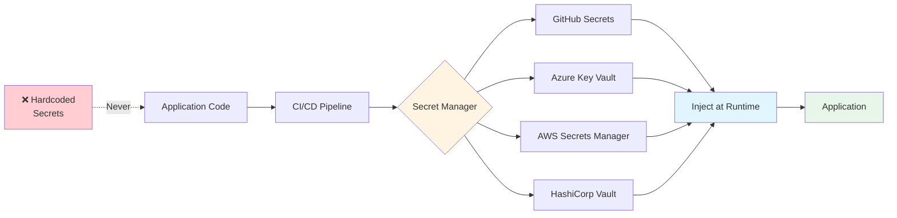

**シークレット管理のベストプラクティス**:

1. **環境変数として注入**:
   ```yaml
   # GitHub Actions 例
   env:
     DATABASE_URL: ${{ secrets.DATABASE_URL }}
     API_KEY: ${{ secrets.API_KEY }}
   ```

2. **絶対にコミットしない**:
   - `.env` ファイルは `.gitignore` に追加
   - pre-commit フックで検出
   - Git history スキャン（git-secrets、Gitleaks）

3. **ローテーション**:
   - 定期的にシークレットを更新（90日毎推奨）
   - 自動ローテーション機能の活用

4. **アクセス制御**:
   - 必要最小限のスコープのみ付与
   - 読み取り専用トークンの活用

#### 7.2.3 最小権限の原則

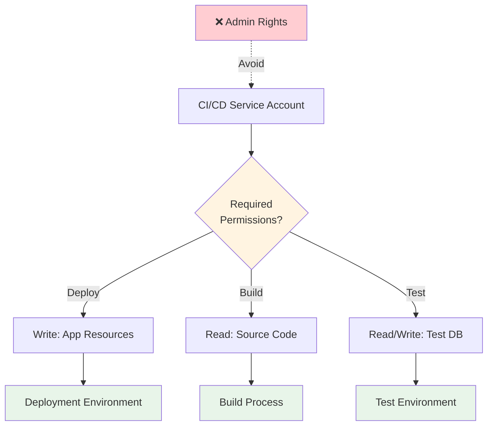

**権限設定例**:

| 環境 | 必要な権限 | 不要な権限 |
|------|-----------|-----------|
| ビルド | ソースコード読取、依存関係取得 | 本番環境書込、IAM変更 |
| テスト | テストDB読書、一時リソース作成 | 本番DB接続、本番リソース変更 |
| デプロイ | 対象環境のアプリ更新 | IAM変更、他環境アクセス |

#### 7.2.4 セキュリティスキャンツール統合

**SAST（Static Application Security Testing）**:
- SonarQube、Checkmarx、Veracode
- コードレビュー前に実行
- SQL injection、XSS、認証バイパスなど検出

**DAST（Dynamic Application Security Testing）**:
- OWASP ZAP、Burp Suite
- ステージング環境で実行
- 実行時の脆弱性検出

**依存関係スキャン**:
- Dependabot、Snyk、OWASP Dependency-Check
- 既知の脆弱性（CVE）検出
- 自動Pull Request作成

### 7.3 モニタリング

CI/CDパイプラインの健全性とパフォーマンスを継続的に監視し、改善につなげます。

#### 7.3.1 モニタリングアーキテクチャ

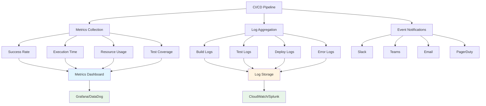

#### 7.3.2 主要メトリクス

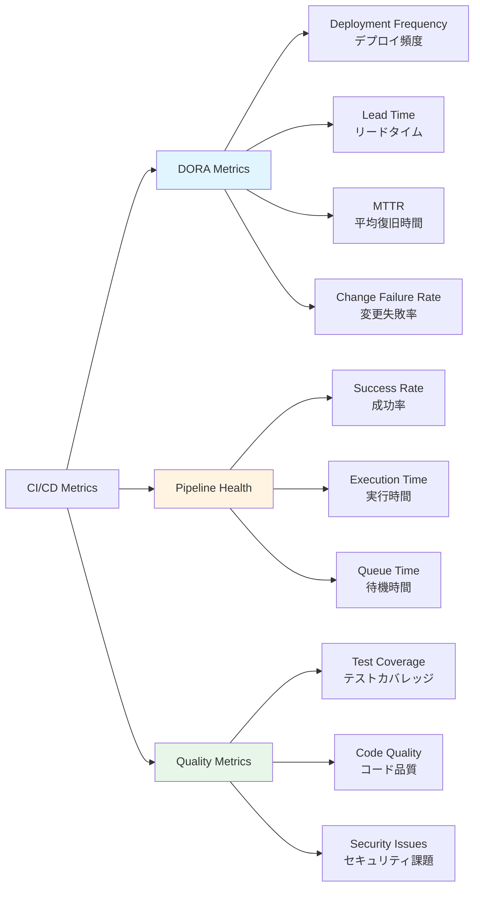

**DORA（DevOps Research and Assessment）メトリクス**:

| メトリクス | エリートチーム | ハイパフォーマンス | ミディアム | ロー |
|-----------|---------------|-------------------|-----------|------|
| デプロイ頻度 | 1日複数回 | 週1回〜月1回 | 月1回〜6ヶ月1回 | 6ヶ月1回未満 |
| リードタイム | 1時間未満 | 1日〜1週間 | 1週間〜1ヶ月 | 1ヶ月以上 |
| MTTR | 1時間未満 | 1時間〜1日 | 1日〜1週間 | 1週間以上 |
| 変更失敗率 | 0-15% | 16-30% | 31-45% | 46%以上 |

#### 7.3.3 ダッシュボード例

**パイプライン成功率ダッシュボード**:
```
┌─────────────────────────────────────────────────────┐
│ CI/CD Pipeline Dashboard                            │
├─────────────────────────────────────────────────────┤
│ 成功率（過去7日間）                                  │
│ ████████████████████████████████████░░░░ 89.5%      │
│                                                     │
│ 平均実行時間                                         │
│ Build:  ████░░░░░░ 5m 23s                          │
│ Test:   ██████░░░░ 8m 47s                          │
│ Deploy: ██░░░░░░░░ 3m 12s                          │
│                                                     │
│ 今週のデプロイ: 47回 ↑ 12%                         │
│ テストカバレッジ: 87.3% ↑ 2.1%                     │
└─────────────────────────────────────────────────────┘
```

#### 7.3.4 通知設定

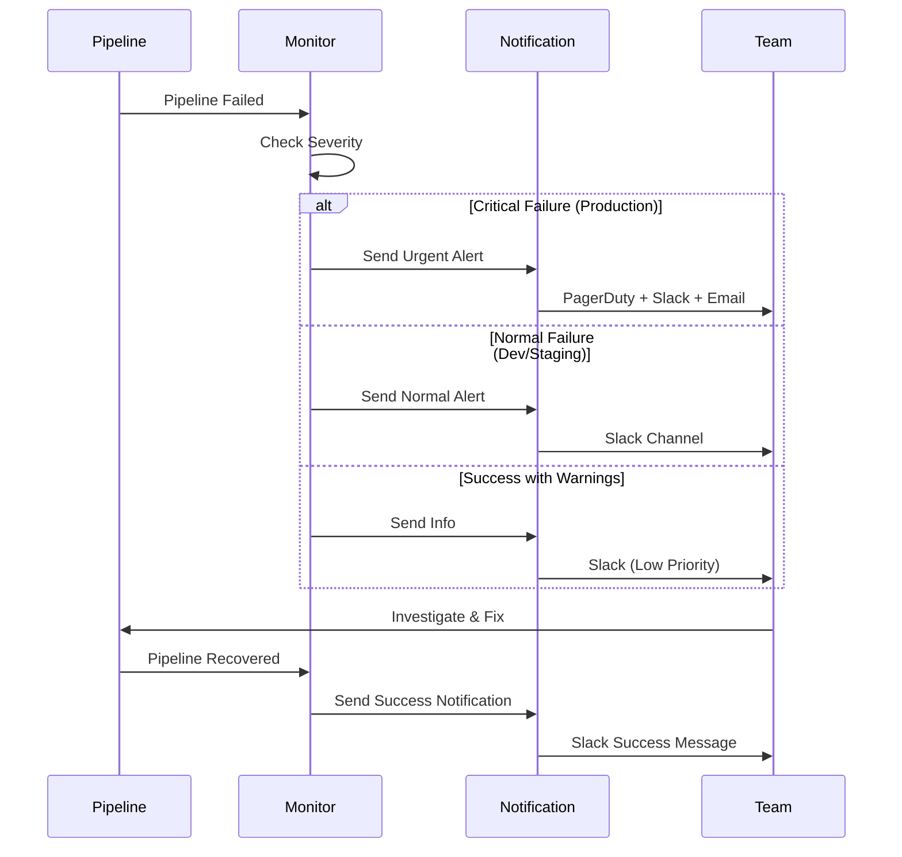

**通知レベル別設定**:

| レベル | 条件 | 通知先 | 優先度 |
|--------|------|--------|--------|
| 🔴 Critical | 本番デプロイ失敗 | PagerDuty + Slack + Email | 緊急 |
| 🟠 High | セキュリティスキャン失敗 | Slack + Email | 高 |
| 🟡 Medium | テスト失敗 | Slack Channel | 中 |
| 🟢 Low | 成功（警告あり） | Slack（スレッド） | 低 |
| ⚪ Info | 成功 | ログのみ | 情報 |

#### 7.3.5 ログ保存戦略

**ログ保存期間**:
- ビルドログ: 90日間
- デプロイログ: 1年間
- セキュリティスキャン結果: 2年間（コンプライアンス要件）
- エラーログ: 6ヶ月間

**ログレベル**:
```
DEBUG → 開発環境のみ
INFO  → すべての環境
WARN  → 要注意事項、即時対応不要
ERROR → 即時対応必要
```

### 7.4 ブランチ戦略

効果的なブランチ戦略は、チームの協働を円滑にし、リリースプロセスを安定させます。

#### 7.4.1 Git Flow

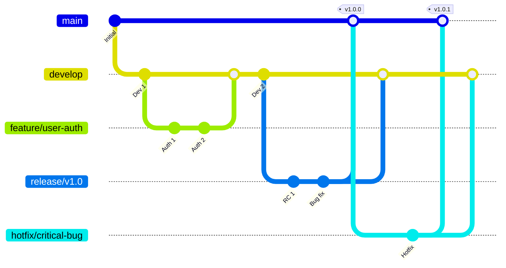

**ブランチの役割**:

| ブランチ | 用途 | 作成元 | マージ先 | 生存期間 |
|---------|------|--------|---------|---------|
| `main` | 本番リリース | - | - | 永続 |
| `develop` | 開発統合 | `main` | `main` | 永続 |
| `feature/*` | 機能開発 | `develop` | `develop` | 一時的 |
| `release/*` | リリース準備 | `develop` | `main`, `develop` | 一時的 |
| `hotfix/*` | 緊急修正 | `main` | `main`, `develop` | 一時的 |

#### 7.4.2 GitHub Flow（シンプル版）

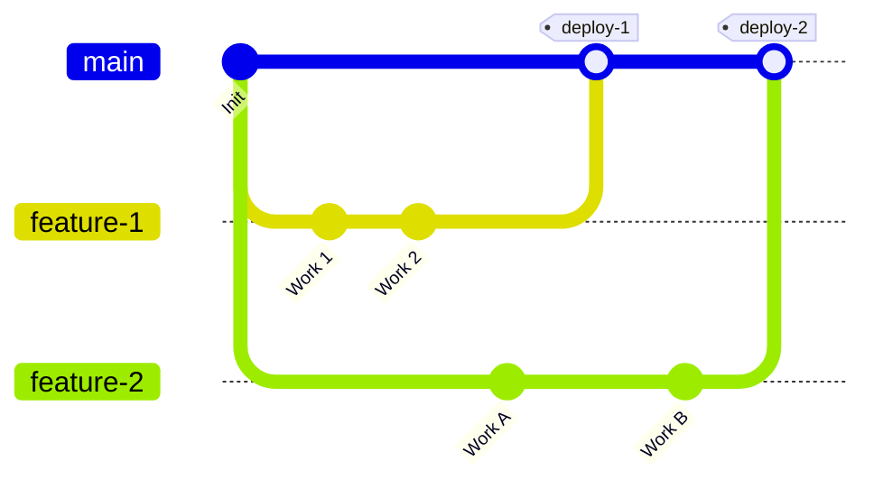

**GitHub Flow の特徴**:
- `main` ブランチは常にデプロイ可能
- フィーチャーブランチから直接 `main` へマージ
- マージ後は即座にデプロイ
- シンプルで理解しやすい

**適用場面**:
- ✅ 継続的デプロイ環境
- ✅ 小〜中規模チーム
- ✅ SaaS製品
- ❌ 複数バージョン同時保守

#### 7.4.3 Trunk Based Development

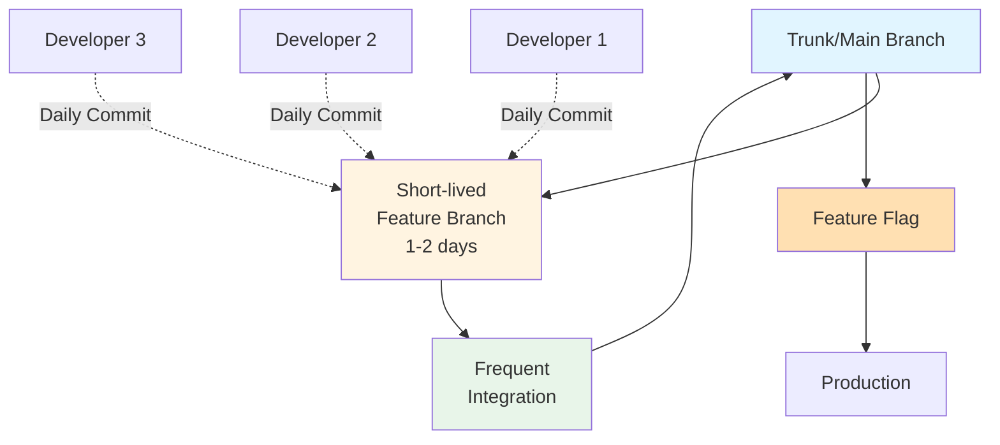

**特徴**:
- 短命のフィーチャーブランチ（1〜2日）
- 1日に複数回の統合
- フィーチャーフラグで未完成機能を隠蔽
- 継続的インテグレーションに最適

#### 7.4.4 プルリクエストワークフロー

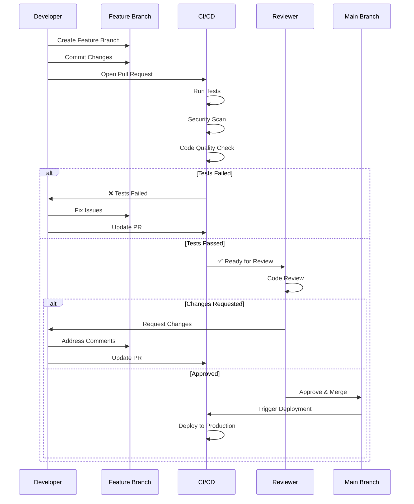

**プルリクエストのチェックリスト**:
- ✅ すべての自動テストが通過
- ✅ セキュリティスキャンでCritical/Highなし
- ✅ コードカバレッジが基準を満たしている
- ✅ 最低1人のレビュアー承認
- ✅ ブランチが最新のmainから更新されている
- ✅ コンフリクトが解決されている

#### 7.4.5 保護ブランチ設定

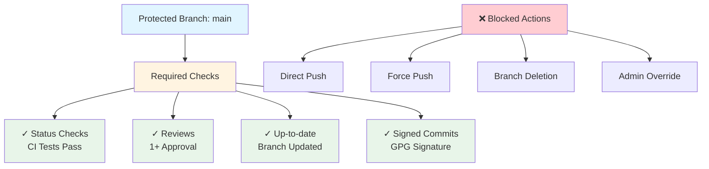

**GitHub/GitLab 設定例**:

```yaml
# .github/branch-protection.yml
rules:
  main:
    required_status_checks:
      - ci/tests
      - security/scan
      - code-quality/check
    required_approvals: 1
    dismiss_stale_reviews: true
    require_code_owner_reviews: true
    enforce_admins: true
    restrict_pushes:
      users: []
      teams: []
```

#### 7.4.6 タグ付けとリリース

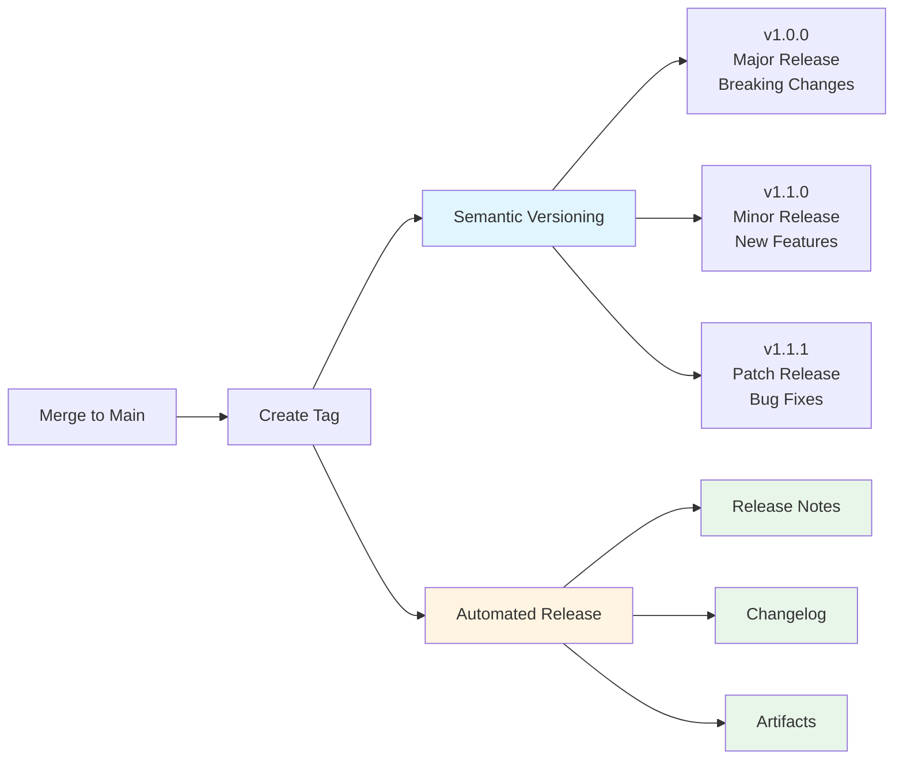

**Semantic Versioning（セマンティックバージョニング）**:

```
v[MAJOR].[MINOR].[PATCH]

例:
v1.0.0 → 初回リリース
v1.1.0 → 新機能追加（後方互換性あり）
v1.1.1 → バグ修正
v2.0.0 → 破壊的変更
```

**自動タグ付け例**:
```yaml
# GitHub Actions
- name: Create Release
  uses: actions/create-release@v1
  with:
    tag_name: v${{ github.run_number }}
    release_name: Release v${{ github.run_number }}
    draft: false
    prerelease: false
```

#### 7.4.7 ブランチ戦略の比較

| 戦略 | 複雑度 | チーム規模 | リリース頻度 | 適用場面 |
|------|--------|-----------|-------------|---------|
| **Git Flow** | 高 | 大規模 | 月次〜四半期 | エンタープライズ、複数バージョン保守 |
| **GitHub Flow** | 低 | 小〜中規模 | 日次〜週次 | SaaS、継続的デプロイ |
| **Trunk Based** | 中 | 全規模 | 1日複数回 | 高頻度リリース、マイクロサービス |

---

**関連ドキュメント**:
- [7. 実装（アプリケーション）](./dev_process_開発工程_7_実装_アプリケーション.md)
- [8. インフラ構築](./dev_process_開発工程_8_インフラ構築.md)
- [9. アプリケーションテスト](./dev_process_開発工程_9_テスト_アプリケーション.md)
- [10. インフラテスト](./dev_process_開発工程_10_テスト_インフラ.md)

---

**最終更新日**: 2025年（令和7年）
**文書バージョン**: 1.0
