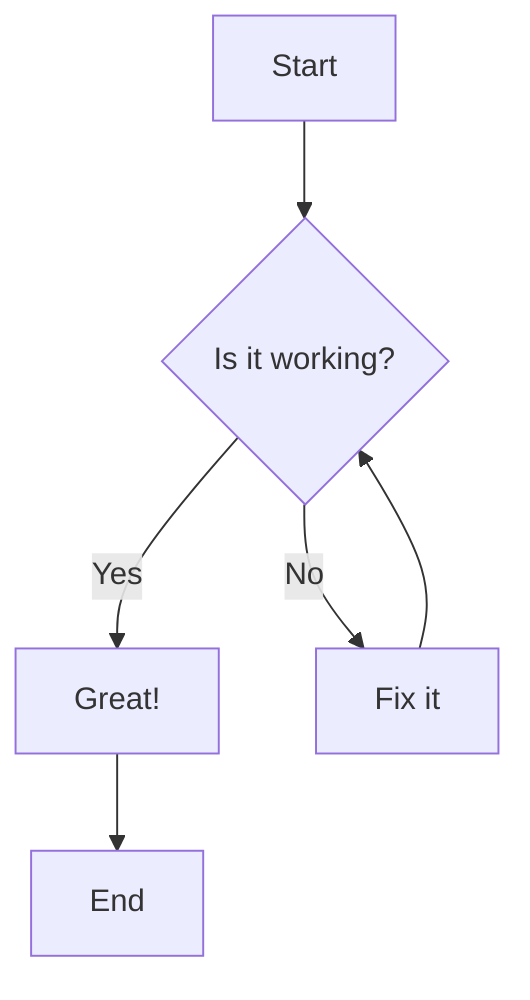
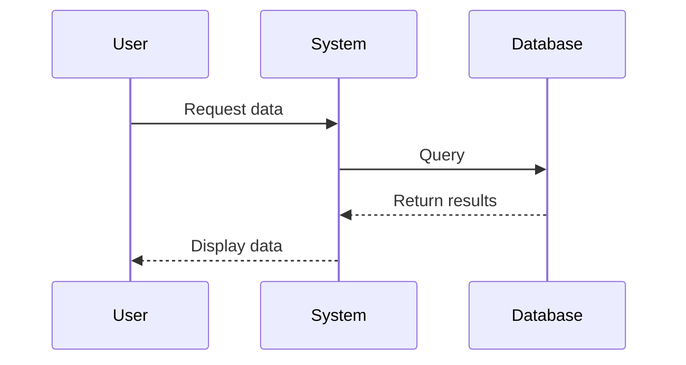
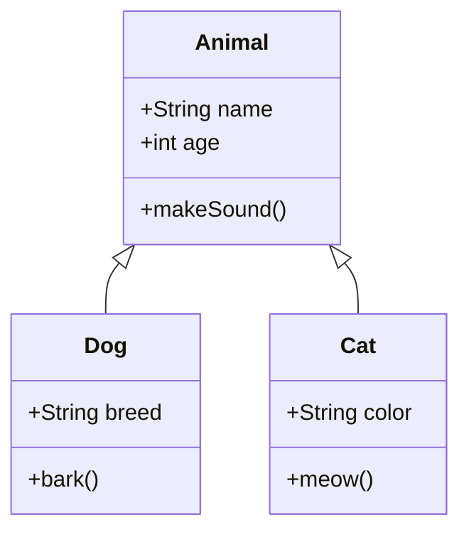
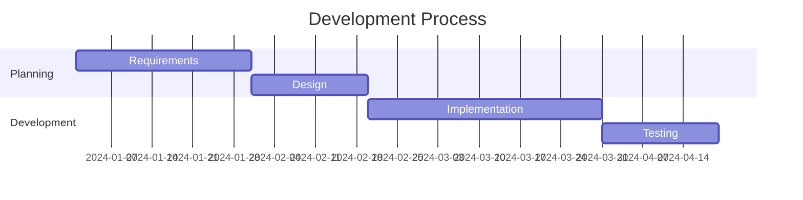
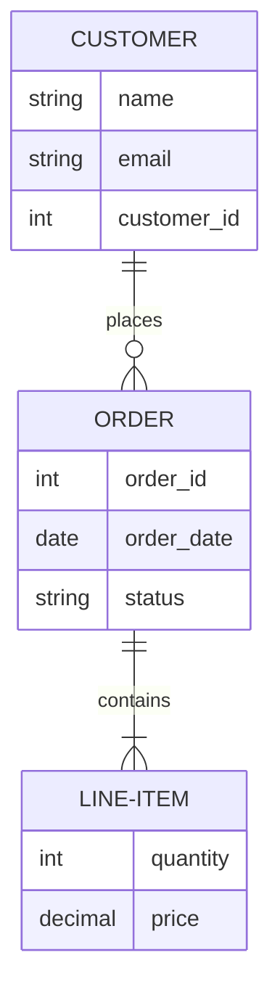
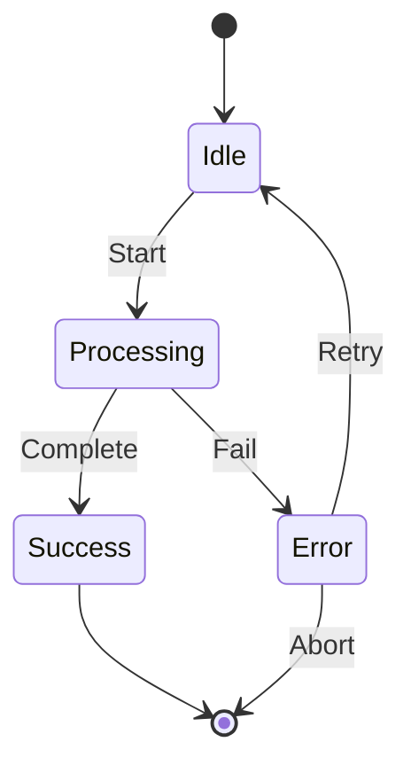

# Mermaid Diagram Test

This document contains various Mermaid diagrams to test PDF conversion.

## Flowchart Example

## Sequence Diagram Example

## Class Diagram Example

## Gantt Chart Example

## ER Diagram Example

## State Diagram Example

## Conclusion

All Mermaid diagrams should be rendered correctly in the PDF output.
