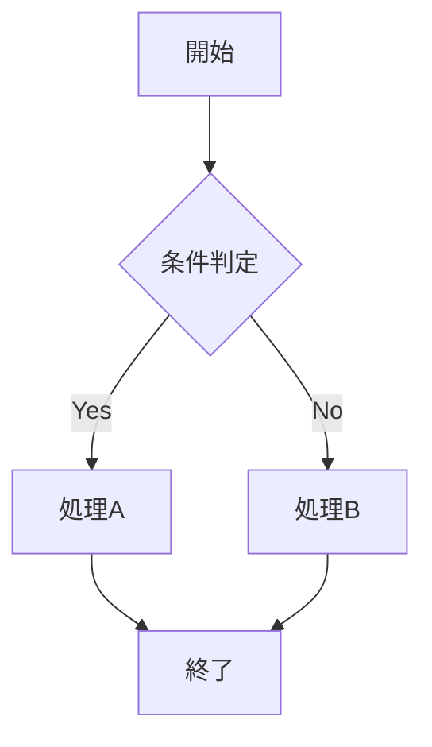
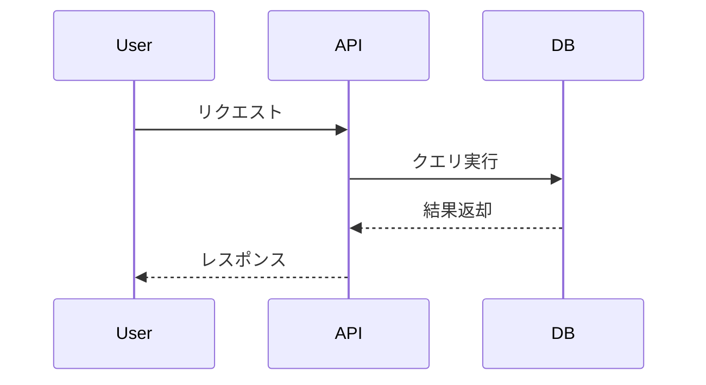
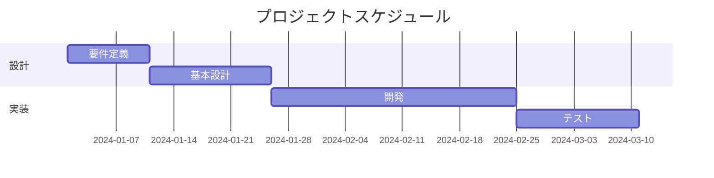
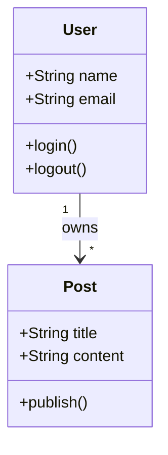
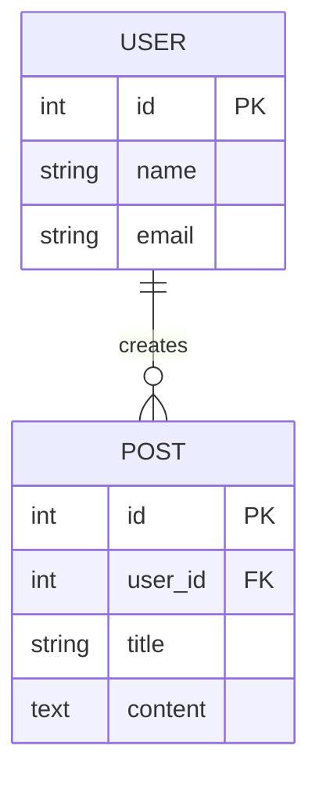
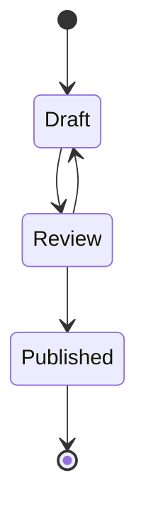
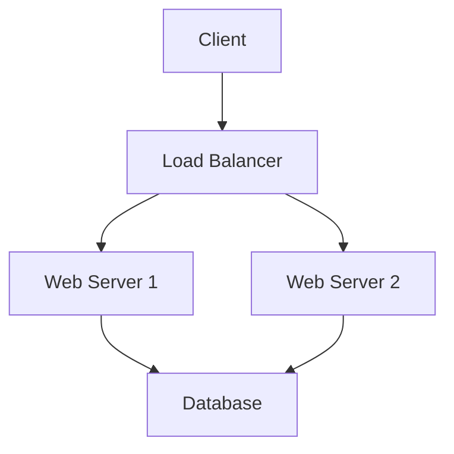

# Mermaid

## 概要

Mermaidは、テキストベースで図を作成できるオープンソースのダイアグラム生成ツールです。Markdown風の記法でフローチャート、シーケンス図、ガントチャート、ER図等を記述し、自動的に美しい図に変換します。GitHubドキュメント、Notion、Confluence等に統合され、バージョン管理可能なダイアグラムとしてDevOpsワークフローに組み込めます。

## 主な機能

### 1. ダイアグラムタイプ
- **フローチャート**: プロセスフロー
- **シーケンス図**: オブジェクト間相互作用
- **ガントチャート**: プロジェクトスケジュール
- **クラス図**: UMLクラス図
- **ER図**: データベース関係図
- **状態遷移図**: ステートマシン
- **パイチャート**: 円グラフ
- **ジャーニーマップ**: ユーザージャーニー

### 2. テキストベース
- **Markdown統合**: ドキュメント内に埋め込み
- **バージョン管理**: Gitで管理
- **差分比較**: テキストdiffで変更追跡
- **コードレビュー**: Pull Requestでレビュー

### 3. 統合
- **GitHub/GitLab**: READMEに自動レンダリング
- **VS Code**: 拡張機能でプレビュー
- **Notion**: ブロックとして埋め込み
- **Confluence**: マクロで表示
- **Docusaurus**: ドキュメントサイト統合

### 4. スタイリング
- **テーマ**: default、dark、forest、neutral
- **カスタムCSS**: スタイルカスタマイズ
- **色指定**: ノード・エッジの色

## 利用方法

### フローチャート



### シーケンス図



### ガントチャート



### クラス図



### ER図



### 状態遷移図



### GitHub統合

```markdown
# README.md

## Architecture


GitHubが自動的にレンダリング
```

### VS Code統合

```bash
# 拡張機能インストール
Mermaid Preview (bierner.markdown-mermaid)
または
Markdown Preview Mermaid Support

# プレビュー表示
Ctrl+Shift+V (Markdown Preview)
```

### HTML埋め込み

```html
<!DOCTYPE html>
<html>
<head>
  <script src="https://cdn.jsdelivr.net/npm/mermaid/dist/mermaid.min.js"></script>
  <script>mermaid.initialize({ startOnLoad: true });</script>
</head>
<body>
  <div class="mermaid">
    graph TD
      A[開始] --> B[処理]
      B --> C[終了]
  </div>
</body>
</html>
```

### CLI使用

```bash
# npmインストール
npm install -g @mermaid-js/mermaid-cli

# 画像生成
mmdc -i diagram.mmd -o diagram.png
mmdc -i diagram.mmd -o diagram.svg
mmdc -i diagram.mmd -o diagram.pdf
```

## エディション・料金

| エディション | 価格 | 特徴 |
|-------------|------|------|
| **Mermaid (OSS)** | 🟢 完全無料 | オープンソース、MIT License |

## メリット

### ✅ 主な利点

1. **完全無料**: オープンソース、MIT License
2. **テキストベース**: バージョン管理可能
3. **GitHub統合**: 自動レンダリング
4. **多様なダイアグラム**: 10+タイプ対応
5. **学習容易**: Markdown風記法
6. **差分比較**: テキストdiffで変更追跡
7. **軽量**: 追加ツール不要
8. **統合**: Notion、Confluence対応
9. **CLIツール**: 画像自動生成
10. **コミュニティ**: 活発な開発

## デメリット

### ❌ 制約・課題

1. **レイアウト制御**: 自動レイアウトのみ
2. **複雑な図**: 大規模図で読みにくい
3. **学習曲線**: 記法の習得必要
4. **エラーメッセージ**: 分かりにくい
5. **IDE統合**: 一部エディタでサポート限定的
6. **カスタマイズ**: スタイリングに制約
7. **インタラクティブ**: 静的図のみ
8. **細かい調整**: 位置調整困難

## 代替ツール

| ツール | 特徴 | 比較 |
|--------|------|------|
| **PlantUML** | テキストベースUML | Mermaidと類似、UML特化 |
| **Graphviz** | テキストベースグラフ | MermaidよりDOT言語 |
| **draw.io (diagrams.net)** | GUIベース作図 | Mermaidより柔軟だがバージョン管理困難 |
| **Lucidchart** | 商用、協業 | Mermaidより高機能だが有料 |
| **D2** | テキストベース、モダン | Mermaidより新しい |

## 公式リンク

- **公式サイト**: [https://mermaid.js.org/](https://mermaid.js.org/)
- **GitHub**: [https://github.com/mermaid-js/mermaid](https://github.com/mermaid-js/mermaid)
- **Live Editor**: [https://mermaid.live/](https://mermaid.live/)
- **ドキュメント**: [https://mermaid.js.org/intro/](https://mermaid.js.org/intro/)

## 関連ドキュメント

- [作図ツール一覧](../作図ツール/)
- [PlantUML](./PlantUML.md)
- [draw.io](./draw.io.md)
- [Lucidchart](./Lucidchart.md)
- [ダイアグラムベストプラクティス](../../best-practices/diagrams.md)

---

**カテゴリ**: 作図ツール  
**対象工程**: 設計、ドキュメント作成  
**最終更新**: 2025年12月  
**ドキュメントバージョン**: 1.0
