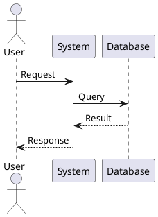

# Visual Studio Code (VS Code)

## 概要

Visual Studio Code（VS Code）は、Microsoftが開発した無料のオープンソースコードエディタです。軽量ながら強力な機能を持ち、拡張機能により様々なプログラミング言語や開発環境に対応できます。

**主な特徴:**
- クロスプラットフォーム（Windows、macOS、Linux）
- 豊富な拡張機能（50,000以上）
- 統合ターミナル
- Git統合
- IntelliSense（コード補完）
- デバッグ機能
- リモート開発サポート（SSH、WSL、Containers）

## 料金プラン

| プラン | 料金 | 主な機能 |
|--------|------|----------|
| **VS Code** | 完全無料 | すべての機能が利用可能 |
| **GitHub Copilot** | $10/月 | AI支援コード補完（オプション） |
| **GitHub Copilot Business** | $19/ユーザー/月 | エンタープライズ向けCopilot |

※ VS Code本体はMITライセンスの完全無料ソフトウェア

## メリット・デメリット

### メリット

1. **完全無料**: すべての機能が無料で利用可能
2. **軽量高速**: 起動が速く、動作が軽快
3. **豊富な拡張機能**: 50,000以上の拡張機能でカスタマイズ可能
4. **マルチ言語対応**: JavaScript、Python、Java、C++等、あらゆる言語をサポート
5. **Git統合**: Git操作がエディタ内で完結
6. **リモート開発**: SSH、WSL、Dockerコンテナでの開発が可能
7. **アクティブなコミュニティ**: 活発な開発とサポート
8. **Live Share**: リアルタイムコラボレーション機能

### デメリット

1. **IDE機能の制限**: 完全なIDEと比較すると機能が限定的
2. **拡張機能への依存**: 言語サポートには拡張機能のインストールが必要
3. **メモリ消費**: 多数の拡張機能を使用すると重くなる
4. **リファクタリング機能**: IntelliJ等の専用IDEより弱い
5. **プロジェクト管理**: 大規模プロジェクトの管理機能が限定的

## 利用できる開発工程

| 工程 | 活用度 | 主な用途 |
|------|--------|----------|
| 企画プロセス | ⭐⭐⭐ | ドキュメント作成、メモ |
| 要件定義 | ⭐⭐⭐ | 仕様書作成、マークダウン編集 |
| アーキテクチャ設計 | ⭐⭐⭐⭐ | 設計書作成、図の作成 |
| 詳細設計 | ⭐⭐⭐⭐ | コード設計、UMLプラグイン |
| 開発 | ⭐⭐⭐⭐⭐ | コーディング、デバッグ |
| テスト | ⭐⭐⭐⭐⭐ | テストコード作成、実行 |
| リリース | ⭐⭐⭐⭐ | デプロイスクリプト編集 |
| 運用・保守 | ⭐⭐⭐⭐ | ログ確認、設定ファイル編集 |

## 基本的な利用方法

### 1. インストール

```bash
# Windows (Chocolatey)
choco install vscode

# macOS (Homebrew)
brew install --cask visual-studio-code

# Linux (Debian/Ubuntu)
wget -qO- https://packages.microsoft.com/keys/microsoft.asc | gpg --dearmor > packages.microsoft.gpg
sudo install -D -o root -g root -m 644 packages.microsoft.gpg /etc/apt/keyrings/packages.microsoft.gpg
sudo sh -c 'echo "deb [arch=amd64,arm64,armhf signed-by=/etc/apt/keyrings/packages.microsoft.gpg] https://packages.microsoft.com/repos/code stable main" > /etc/apt/sources.list.d/vscode.list'
sudo apt update
sudo apt install code
```

### 2. 基本操作

```
ファイル操作:
- Ctrl/Cmd + N: 新規ファイル
- Ctrl/Cmd + O: ファイルを開く
- Ctrl/Cmd + S: 保存
- Ctrl/Cmd + Shift + S: 名前を付けて保存
- Ctrl/Cmd + W: ファイルを閉じる

編集操作:
- Ctrl/Cmd + C/V/X: コピー/貼り付け/切り取り
- Ctrl/Cmd + Z/Y: 元に戻す/やり直し
- Ctrl/Cmd + F: 検索
- Ctrl/Cmd + H: 置換
- Alt + Shift + F: コードフォーマット

ナビゲーション:
- Ctrl/Cmd + P: ファイル検索
- Ctrl/Cmd + Shift + F: プロジェクト全体検索
- Ctrl/Cmd + G: 行番号へジャンプ
- F12: 定義へジャンプ
- Shift + F12: 参照を検索
```

### 3. 拡張機能のインストール

```
方法1: GUIから
1. 左サイドバーの拡張機能アイコンをクリック（Ctrl/Cmd + Shift + X）
2. 検索ボックスで拡張機能を検索
3. 「インストール」をクリック

方法2: コマンドラインから
code --install-extension ms-python.python
code --install-extension esbenp.prettier-vscode
code --install-extension dbaeumer.vscode-eslint
```

### 4. ワークスペースとプロジェクト

```json
// .vscode/settings.json
{
  "editor.formatOnSave": true,
  "editor.tabSize": 2,
  "files.autoSave": "afterDelay",
  "files.exclude": {
    "**/.git": true,
    "**/.DS_Store": true,
    "**/node_modules": true
  }
}
```

## 工程別の活用方法

### 企画・要件定義での活用

**マークダウン編集:**
```markdown
推奨拡張機能:
- Markdown All in One
- Markdown Preview Enhanced
- Markdownlint

使い方:
1. .mdファイルを開く
2. Ctrl/Cmd + Shift + V でプレビュー表示
3. Ctrl/Cmd + K V でサイドバイサイドプレビュー
```

**図の作成:**
```
拡張機能:
- Draw.io Integration
- PlantUML
- Mermaid Preview

PlantUML例:

```

### アーキテクチャ設計での活用

**設計ドキュメント管理:**
```
推奨フォルダ構造:
project/
├── docs/
│   ├── architecture/
│   │   ├── system-overview.md
│   │   ├── component-diagram.puml
│   │   └── deployment.md
│   └── api/
│       └── openapi.yaml

拡張機能:
- PlantUML（UML図）
- OpenAPI (Swagger) Editor（API設計）
- C4 PlantUML（C4モデル）
```

**コードスニペット:**
```json
// .vscode/snippets.code-snippets
{
  "Component Template": {
    "prefix": "comp",
    "body": [
      "/**",
      " * ${1:ComponentName}",
      " * @description ${2:Description}",
      " */",
      "export const ${1:ComponentName} = () => {",
      "  return (",
      "    <div>",
      "      $0",
      "    </div>",
      "  );",
      "};"
    ],
    "description": "React component template"
  }
}
```

### 開発での活用

**必須拡張機能（言語別）:**

```
JavaScript/TypeScript:
- ESLint
- Prettier - Code formatter
- JavaScript (ES6) code snippets
- Path Intellisense
- Auto Import

Python:
- Python
- Pylance
- Python Indent
- autoDocstring
- Jupyter

Java:
- Extension Pack for Java
- Language Support for Java
- Debugger for Java
- Maven for Java
- Spring Boot Extension Pack

Go:
- Go
- Go Test Explorer

Rust:
- rust-analyzer
- crates
- Better TOML
```

**デバッグ設定:**
```json
// .vscode/launch.json
{
  "version": "0.2.0",
  "configurations": [
    {
      "name": "Python: Current File",
      "type": "python",
      "request": "launch",
      "program": "${file}",
      "console": "integratedTerminal",
      "justMyCode": true
    },
    {
      "name": "Node.js: Current File",
      "type": "node",
      "request": "launch",
      "program": "${file}",
      "skipFiles": ["<node_internals>/**"]
    },
    {
      "name": "Java: Current File",
      "type": "java",
      "request": "launch",
      "mainClass": "${file}"
    }
  ]
}
```

**タスク自動化:**
```json
// .vscode/tasks.json
{
  "version": "2.0.0",
  "tasks": [
    {
      "label": "npm build",
      "type": "npm",
      "script": "build",
      "problemMatcher": ["$tsc"]
    },
    {
      "label": "Run tests",
      "type": "shell",
      "command": "npm test",
      "group": {
        "kind": "test",
        "isDefault": true
      }
    },
    {
      "label": "Docker build",
      "type": "shell",
      "command": "docker build -t myapp:latest .",
      "problemMatcher": []
    }
  ]
}
```

**Git統合:**
```
基本操作:
1. ソース管理ビュー（Ctrl/Cmd + Shift + G）を開く
2. 変更ファイルを確認
3. 「+」でステージング
4. コミットメッセージを入力
5. 「✓」でコミット
6. 「...」→「プッシュ」

推奨拡張機能:
- GitLens（Git履歴の可視化）
- Git Graph（ブランチグラフ）
- GitHub Pull Requests and Issues
```

### テストでの活用

**テストエクスプローラー:**
```
拡張機能:
- Test Explorer UI
- Python Test Explorer
- Jest Test Explorer
- Mocha Test Explorer

使い方:
1. テストファイルを開く
2. テストエクスプローラービューを開く
3. テストを選択して実行
4. 結果をインラインで確認
```

**テストカバレッジ:**
```
拡張機能:
- Coverage Gutters

設定:
1. カバレッジレポートを生成（lcov.info）
2. 拡張機能が自動的に検出
3. エディタの行番号横にカバレッジ状況を表示
   - 緑: カバー済み
   - 赤: 未カバー
   - 黄: 部分的にカバー
```

### リモート開発での活用

**Remote - SSH:**
```bash
# 使い方
1. 拡張機能「Remote - SSH」をインストール
2. Ctrl/Cmd + Shift + P →「Remote-SSH: Connect to Host」
3. SSH接続情報を入力
4. リモートサーバー上でVS Codeが起動

# SSH設定ファイル（~/.ssh/config）
Host dev-server
    HostName 192.168.1.100
    User developer
    IdentityFile ~/.ssh/id_rsa
```

**Dev Containers:**
```json
// .devcontainer/devcontainer.json
{
  "name": "Python 3 Development",
  "image": "mcr.microsoft.com/devcontainers/python:3.11",
  "customizations": {
    "vscode": {
      "extensions": [
        "ms-python.python",
        "ms-python.pylint"
      ],
      "settings": {
        "python.defaultInterpreterPath": "/usr/local/bin/python"
      }
    }
  },
  "postCreateCommand": "pip install -r requirements.txt",
  "remoteUser": "vscode"
}
```

**WSL (Windows Subsystem for Linux):**
```bash
# 使い方
1. 拡張機能「WSL」をインストール
2. Ctrl/Cmd + Shift + P →「WSL: New Window」
3. WSL環境でVS Codeが起動

# またはターミナルから
wsl
code .
```

### 運用・保守での活用

**ログファイル閲覧:**
```
拡張機能:
- Log File Highlighter
- Log Viewer

機能:
- ログレベル（ERROR、WARN、INFO）のハイライト
- タイムスタンプの強調
- 大容量ログファイルの効率的な閲覧
```

**設定ファイル編集:**
```
拡張機能:
- YAML（YAML Language Support）
- XML Tools
- Better TOML
- DotENV

機能:
- シンタックスハイライト
- スキーマ検証
- オートコンプリート
```

## 公式ドキュメント

- **公式サイト**: https://code.visualstudio.com/
- **ドキュメント**: https://code.visualstudio.com/docs
- **API リファレンス**: https://code.visualstudio.com/api
- **拡張機能マーケットプレイス**: https://marketplace.visualstudio.com/vscode
- **GitHub リポジトリ**: https://github.com/microsoft/vscode

## 学習リソース

### 公式リソース

1. **VS Code ドキュメント（日本語）**
   - URL: https://code.visualstudio.com/docs?locale=ja
   - 公式チュートリアル、ガイド

2. **VS Code YouTube チャンネル**
   - URL: https://www.youtube.com/@code
   - Tips、新機能紹介、ライブコーディング

3. **VS Code Blog**
   - URL: https://code.visualstudio.com/blogs
   - リリースノート、ベストプラクティス

### 外部リソース

1. **Visual Studio Code入門（日本語書籍）**
   - 初心者向けガイドブック

2. **Udemy コース**
   - 「Visual Studio Code 入門」
   - 「VS Code for Web Development」

3. **Qiita/Zenn 記事**
   - 日本語のTips、拡張機能紹介

## 関連リンク

### 推奨拡張機能パック

**一般開発:**
- **Better Comments**: コメントのハイライト
- **Error Lens**: エラーをインラインで表示
- **Path Intellisense**: ファイルパスの補完
- **Bracket Pair Colorizer 2**: 括弧のペアを色分け（※ VS Code 1.60+では標準機能化）
- **indent-rainbow**: インデントを色分け

**生産性向上:**
- **GitHub Copilot**: AI支援コード補完
- **Tabnine**: AI コード補完
- **CodeSnap**: コードのスクリーンショット
- **Todo Tree**: TODOコメントの可視化

**コラボレーション:**
- **Live Share**: リアルタイム共同編集
- **Code Together**: ペアプログラミング

### コミュニティ

- **VS Code Twitter**: @code
- **VS Code Reddit**: r/vscode
- **Stack Overflow**: タグ「visual-studio-code」

### 代替・補完ツール

- **IntelliJ IDEA**: Java開発向け統合IDE
- **PyCharm**: Python専用IDE
- **Eclipse**: Java開発IDE
- **Atom**: GitHub製エディタ（開発終了）
- **Sublime Text**: 軽量エディタ
- **Vim/Neovim**: ターミナルエディタ

## ベストプラクティス

### 設定のベストプラクティス

```json
// settings.json のおすすめ設定
{
  // エディタ
  "editor.formatOnSave": true,
  "editor.codeActionsOnSave": {
    "source.fixAll.eslint": true,
    "source.organizeImports": true
  },
  "editor.tabSize": 2,
  "editor.rulers": [80, 120],
  "editor.minimap.enabled": true,
  "editor.bracketPairColorization.enabled": true,

  // ファイル
  "files.autoSave": "afterDelay",
  "files.autoSaveDelay": 1000,
  "files.trimTrailingWhitespace": true,
  "files.insertFinalNewline": true,

  // ターミナル
  "terminal.integrated.fontSize": 13,
  "terminal.integrated.cursorBlinking": true,

  // Git
  "git.autofetch": true,
  "git.confirmSync": false,

  // セキュリティ
  "security.workspace.trust.enabled": true
}
```

### キーボードショートカットのカスタマイズ

```json
// keybindings.json
[
  {
    "key": "ctrl+shift+t",
    "command": "workbench.action.terminal.new"
  },
  {
    "key": "ctrl+shift+k",
    "command": "editor.action.deleteLines"
  }
]
```

### ワークスペース管理

```
推奨構造:
.vscode/
├── settings.json      # プロジェクト固有設定
├── launch.json        # デバッグ設定
├── tasks.json         # タスク設定
├── extensions.json    # 推奨拡張機能
└── snippets.code-snippets  # プロジェクト固有スニペット
```
