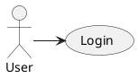
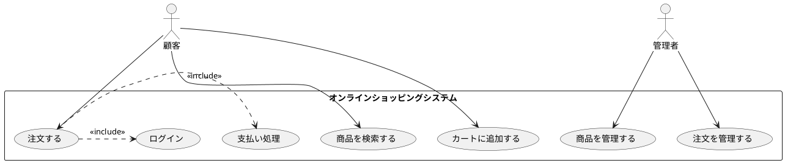
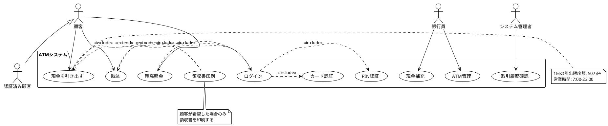
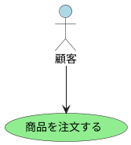
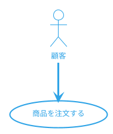
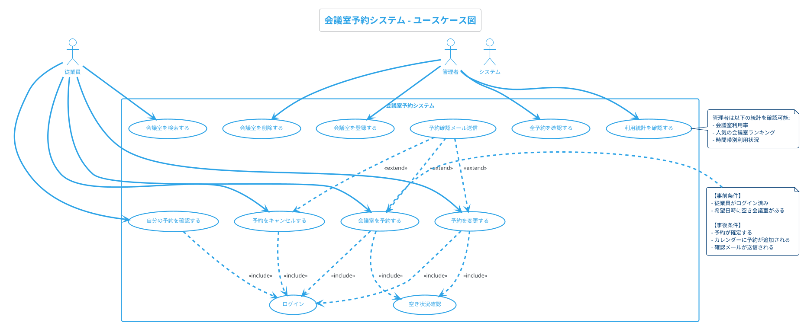

# PlantUML

## 概要

PlantUMLは、テキストベースでUML図を生成するオープンソースツールです。専用の記述言語を使ってユースケース図、クラス図、シーケンス図などを記述し、自動的に図を生成します。GUIツールとは異なり、コードとしてバージョン管理でき、CI/CDパイプラインに統合できる点が特徴です。

### 主な特徴

- **無料**: オープンソースで無料
- **テキストベース**: テキストファイルで図を記述
- **バージョン管理容易**: Git等のバージョン管理システムと親和性が高い
- **CI/CD統合可能**: ビルドパイプラインで図を自動生成
- **自動レイアウト**: 図の配置を自動で最適化

### 対応するUML図

- Use Case Diagram（ユースケース図）
- Class Diagram（クラス図）
- Sequence Diagram（シーケンス図）
- Activity Diagram（アクティビティ図）
- Component Diagram（コンポーネント図）
- その他多数のダイアグラムタイプ

### メリット・デメリット

**メリット**
- 無料でオープンソース
- テキストベースのため、バージョン管理（Git）との相性が良い
- コードレビューで図の変更を追跡可能
- CI/CDパイプラインに統合でき、ドキュメントの自動生成が可能
- 自動レイアウトにより、図の配置を気にせず記述に集中できる

**デメリット**
- GUI編集ができず、テキストでの記述のみ
- 専用の記述言語の学習が必要
- レイアウト制御が困難（自動配置のため、細かい調整が難しい）
- 複雑な図の作成は難しい

## 利用方法

### 1. インストール

PlantUMLは複数の方法で利用できます。

#### 方法1: オンラインエディタ（最も簡単）

1. [PlantUML Online Editor](http://www.plantuml.com/plantuml/uml/)にアクセス
2. ブラウザで直接利用可能（インストール不要）

#### 方法2: VSCode拡張機能

1. Visual Studio Codeをインストール
2. 拡張機能「PlantUML」をインストール（作者: jebbs）
3. Javaランタイム（JRE）をインストール（PlantUMLの実行に必要）
4. Graphvizをインストール（オプション、より高品質なレイアウトのため）

#### 方法3: コマンドライン

1. Javaランタイム（JRE）をインストール
2. [PlantUML JAR](https://plantuml.com/download)をダウンロード
3. コマンドラインで実行:
   ```bash
   java -jar plantuml.jar diagram.puml
   ```

### 2. 基本的な記述方法

PlantUMLは、`@startuml`と`@enduml`で囲んだテキストで図を記述します。

#### 最小限の例



### 3. ユースケース図の記述

#### 基本要素

- **アクター**: `actor アクター名` または `:アクター名:`
- **ユースケース**: `(ユースケース名)` または `usecase (ユースケース名)`
- **関連**: `アクター -> (ユースケース)`
- **Include**: `(ユースケースA) .> (ユースケースB) : <<include>>`
- **Extend**: `(ユースケースA) .> (ユースケースB) : <<extend>>`
- **システム境界**: `rectangle システム名 { ... }`

### 4. ユースケース図の具体例（基本）

**例: オンラインショッピングシステム**



### 5. 詳細な例（Extend、汎化を含む）

**例: 銀行ATMシステム**



### 6. スタイルとテーマのカスタマイズ

#### 色の設定



#### テーマの利用



利用可能なテーマ:
- `plain` - シンプルな白黒
- `cerulean` - セルリアンブルー
- `bluegray` - ブルーグレー
- `sketchy-outline` - 手書き風

### 7. 実践例: 会議室予約システム



### 8. PlantUMLのエクスポート

#### VSCodeでの出力

1. PlantUMLファイル（.puml）を開く
2. `Alt + D`キーでプレビュー表示
3. プレビューを右クリック→「Export Current Diagram」
4. 形式を選択（PNG、SVG、PDF等）

#### コマンドラインでの出力

```bash
# PNG形式で出力
java -jar plantuml.jar diagram.puml

# SVG形式で出力
java -jar plantuml.jar -tsvg diagram.puml

# PDF形式で出力
java -jar plantuml.jar -tpdf diagram.puml
```

### 9. CI/CDパイプラインへの統合

#### GitHub Actionsでの自動生成例

```yaml
name: Generate UML Diagrams

on:
  push:
    paths:
      - '**.puml'

jobs:
  generate:
    runs-on: ubuntu-latest
    steps:
      - uses: actions/checkout@v2

      - name: Setup Java
        uses: actions/setup-java@v2
        with:
          java-version: '11'

      - name: Generate PlantUML Diagrams
        run: |
          wget https://sourceforge.net/projects/plantuml/files/plantuml.jar
          find . -name "*.puml" -exec java -jar plantuml.jar {} \;

      - name: Commit generated images
        run: |
          git config --local user.email "action@github.com"
          git config --local user.name "GitHub Action"
          git add *.png
          git commit -m "Auto-generate UML diagrams" || echo "No changes"
          git push
```

### 10. バージョン管理のベストプラクティス

#### ディレクトリ構成例

```
project/
├── docs/
│   └── uml/
│       ├── use-cases/
│       │   ├── user-management.puml
│       │   ├── order-processing.puml
│       │   └── README.md
│       ├── classes/
│       └── sequences/
├── .gitignore
└── README.md
```

#### .gitignoreの設定

```
# PlantUML生成画像（自動生成されるため）
*.png
*.svg
*.pdf

# ただし、最終版は保持する場合
!docs/final/*.png
```

### 11. VSCode拡張機能の便利機能

#### リアルタイムプレビュー

1. PlantUMLファイルを開く
2. `Alt + D`でプレビュー表示
3. コードを編集すると、リアルタイムで図が更新される

#### スニペット

VSCodeでは、PlantUML用のスニペットを設定できます。

```json
{
  "PlantUML Use Case": {
    "prefix": "puml-usecase",
    "body": [
      "@startuml",
      "actor ${1:ActorName}",
      "(${2:UseCaseName}) as UC${3:1}",
      "",
      "${1} --> UC${3}",
      "@enduml"
    ],
    "description": "PlantUML Use Case Diagram Template"
  }
}
```

### 12. 他のツールとの連携

#### Confluenceへの埋め込み

Atlassian Confluenceでは、PlantUMLマクロを使用して、PlantUMLコードを直接埋め込めます。

#### Markdown内での利用

一部のMarkdownエディタ（Obsidian、HackMD等）では、PlantUMLコードブロックを直接レンダリングできます。

````markdown

````

## 公式ドキュメント

- **公式サイト**: [PlantUML](https://plantuml.com/)
- **ユースケース図ガイド**: [PlantUML Use Case Diagram](https://plantuml.com/use-case-diagram)
- **オンラインエディタ**: [PlantUML Online Server](http://www.plantuml.com/plantuml/uml/)
- **言語リファレンス**: [PlantUML Language Reference Guide](https://plantuml.com/guide)
- **FAQ**: [PlantUML FAQ](https://plantuml.com/faq)

## VSCode拡張機能

- **PlantUML（jebbs）**: [Marketplace Link](https://marketplace.visualstudio.com/items?itemName=jebbs.plantuml)
- **PlantUML Previewer**: リアルタイムプレビュー機能

## 関連リンク

- [PlantUML GitHub Repository](https://github.com/plantuml/plantuml)
- [Real World PlantUML](https://real-world-plantuml.com/) - 実例集
- [PlantUML Cheat Sheet](https://ogom.github.io/draw_uml/plantuml/)
- [UML 2.5 仕様書（OMG公式）](https://www.omg.org/spec/UML/)
- [Awesome PlantUML](https://github.com/plantuml/awesome-plantuml) - リソース集

## サンプルコード集

公式サイトには、多数のサンプルコードが掲載されています:
- [Use Case Diagram Examples](https://plantuml.com/use-case-diagram)
- [Standard Library](https://plantuml.com/stdlib) - アイコン、スプライト集
