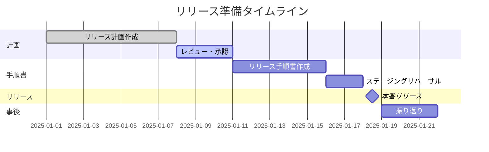

# リリース関連ドキュメント

このディレクトリには、アプリケーションリリースに関する計画書、手順書、注意事項をまとめています。

## 📁 ドキュメント一覧

### 1. [リリース計画.md](./リリース計画.md)

リリース全体の計画を記載する包括的なドキュメントです。

**含まれる内容**:
- リリース概要・目的
- リリース範囲（機能追加・バグ修正・技術改善）
- スケジュール（ガントチャート付き）
- リリース体制・役割分担
- リリース判断基準（Go/No-Go条件）
- リスク管理
- **切り戻し計画**（最重要）
- コミュニケーション計画
- チェックリスト

**使用タイミング**: リリース2〜4週間前から作成開始

### 2. [リリース手順書テンプレート.md](./リリース手順書テンプレート.md)

実際のリリース作業を1ステップずつ記載する詳細手順書のテンプレートです。

**含まれる内容**:
- コピー＆ペーストで実行できるコマンド
- 変化前・変化・変化後の確認手順
- 各フェーズの所要時間
- チェックボックス付きチェックリスト
- 切り戻し手順
- トラブルシューティング

**特徴**:
- **思考停止でもリリースが完了する**レベルの詳細化
- すべてのコマンドが実行可能
- 期待値と実測値を記録できる形式

**使用タイミング**: リリース1週間前までに作成

### 3. [リリース注意事項.md](./リリース注意事項.md)

リリース作業を安全・効率的に実施するためのベストプラクティス集です。

**含まれる内容**:
- リリース前の心構え
- リリース手順書作成の5つの原則
- リリース作業の鉄則
- よくある失敗事例と対策
- 切り戻し判断のガイドライン
- コミュニケーションのベストプラクティス
- データベース変更時の注意事項
- 監視・ログ確認のポイント
- 振り返りの実施方法

**使用タイミング**: リリース前の確認、新メンバーへの教育

---

## 🚀 使い方

### Step 1: リリース計画作成（D-14 〜 D-7）

1. [リリース計画.md](./リリース計画.md) をコピーして新規ファイル作成
   ```bash
   cp リリース計画.md ../リリース/2025-01-25_v1.2.0/リリース計画.md
   ```

2. 以下を記入:
   - リリース概要
   - リリース範囲
   - スケジュール
   - **切り戻し計画**（最優先）
   - リスク管理

3. 関係者にレビュー依頼

### Step 2: リリース手順書作成（D-7 〜 D-3）

1. [リリース手順書テンプレート.md](./リリース手順書テンプレート.md) をコピー
   ```bash
   cp リリース手順書テンプレート.md ../リリース/2025-01-25_v1.2.0/リリース手順書.md
   ```

2. 以下を記入:
   - 実際のコマンド（コピペで実行可能）
   - 環境固有の値（DB接続文字列、URL等）
   - 期待値

3. ステージング環境で**必ずリハーサル実施**

### Step 3: リリース前確認（D-1）

1. [リリース注意事項.md](./リリース注意事項.md) を読み直す

2. チェックリストの最終確認
   - [ ] すべてのテストが合格している
   - [ ] バックアップ手順が確認されている
   - [ ] 切り戻し手順が確認されている
   - [ ] 関係者が準備完了している

### Step 4: リリース実施（D-Day）

1. リリース手順書に沿って実施

2. 15分ごとに進捗報告
   ```markdown
   HH:00 [開始] リリース作業開始
   HH:15 [進行中] バックアップ完了（1/5）
   HH:30 [進行中] デプロイ完了（2/5）
   ...
   ```

3. 問題発生時は即座に切り戻し判断

### Step 5: リリース後振り返り（D+3）

1. 振り返り会議実施（[リリース注意事項.md](./リリース注意事項.md#10-リリース後の振り返り) 参照）

2. 改善点をドキュメントに反映
   ```bash
   git checkout -b improve/release-docs
   vim リリース手順書テンプレート.md
   git commit -m "docs: リリース手順書を改善"
   git push origin improve/release-docs
   ```

---

## 📝 ドキュメント作成の原則

### 1. **切り戻し計画を最優先で作成する**

> 「何か問題が発生した時の切り戻しの計画」が最も重要

- リリース計画の50%は切り戻し計画に充てる
- 制限時間を明確にする（推奨: 2時間以内）
- 切り戻し手順は実際に検証する

### 2. **変化前・変化・変化後の3段階確認**

すべての作業は以下の形式で記載:

```markdown
#### 【変化前】現在の状態確認
```bash
# 確認コマンド
```
**期待値**: xxx
**実際の値**: ___

#### 【変化】作業実施
```bash
# 実行コマンド
```

#### 【変化後】結果確認
```bash
# 確認コマンド
```
**期待値**: yyy
**実際の値**: ___
```

### 3. **コピペで実行できるコマンド**

❌ **NG**:
```bash
# 環境に応じてURLを変更してください
curl <URL>
```

✅ **OK**:
```bash
# 本番環境APIエンドポイント
export API_URL="https://api.example.com"
curl $API_URL/health
```

### 4. **意図を明記する**

各作業に「なぜ」を記載:

```markdown
## データベースバックアップ

**目的**: マイグレーション失敗時にデータを復元するため
**所要時間**: 約10分
**注意事項**: バックアップ完了まで次に進まないこと
```

### 5. **継続的に改善する**

- リリース後の振り返りで必ず改善
- Git管理で履歴を残す
- Pull Requestでレビューを受ける

---

## 🎯 ベストプラクティス

### リリース成功の3つの鍵

1. **計画**: 詳細なリリース計画と切り戻し計画
2. **確認**: 変化前・変化・変化後の3段階確認
3. **改善**: 振り返りによる継続的改善

### 推奨タイムライン



### チェックポイント

| フェーズ | チェックポイント | 担当者 |
|---------|----------------|--------|
| D-14 | リリース計画作成開始 | PM |
| D-7 | リリース計画承認 | リリース責任者 |
| D-7 | リリース手順書作成開始 | 開発 |
| D-3 | ステージングリハーサル実施 | 開発・QA |
| D-1 | 最終確認会議 | 全員 |
| D-Day | リリース実施 | リリース作業者 |
| D+3 | 振り返り会議 | 全員 |

---

## 🔗 関連リソース

### 参考記事

- [リリース手順書の作成が属人化している問題を解決した話](https://tech.kentem.jp/entry/2024/12/21/090000)
- [リリース手順書の書き方](https://agile-monster.com/blog/release-manual/)
- [誰でもわかる実践的な作業手順書の作り方](https://dev.classmethod.jp/articles/how-to-create-a-practical-work-procedure-manual-that-anyone-can-understand/)
- [リリース計画の立て方](https://moneyforward-dev.jp/entry/2021/12/23/release-plan/)

### IPA公式ドキュメント

- [共通フレーム2013 - 導入プロセス](https://www.ipa.go.jp/)
- [システム運用ガイドライン](https://www.ipa.go.jp/)

---

## 📊 ディレクトリ構成例

```
docs/ドキュメント/リリース/
├── README.md                          # このファイル
├── リリース計画.md                     # テンプレート
├── リリース手順書テンプレート.md        # テンプレート
├── リリース注意事項.md                 # ベストプラクティス集
└── releases/                          # 実際のリリースドキュメント
    ├── 2025-01-25_v1.2.0/
    │   ├── リリース計画.md
    │   ├── リリース手順書.md
    │   ├── 切り戻し手順書.md
    │   └── リリース結果報告.md
    ├── 2025-02-15_v1.3.0/
    │   ├── リリース計画.md
    │   ├── リリース手順書.md
    │   └── 切り戻し手順書.md
    └── templates/                     # プロジェクト固有テンプレート
        ├── リリース計画_カスタム.md
        └── リリース手順書_カスタム.md
```

---

## 🤝 貢献

このドキュメントは継続的に改善していきます。

### 改善の流れ

1. リリース後の振り返りで改善点を洗い出す
2. ブランチを作成
   ```bash
   git checkout -b improve/release-docs-YYYYMMDD
   ```
3. ドキュメントを修正
4. Pull Request作成
5. レビュー・マージ

### 改善例

- コマンドの追加・修正
- チェックリスト項目の追加
- トラブルシューティングの追加
- 失敗事例の追加

---

**最終更新日**: 2025年12月
**ドキュメントバージョン**: 1.0
**メンテナンス担当**: 開発チーム
