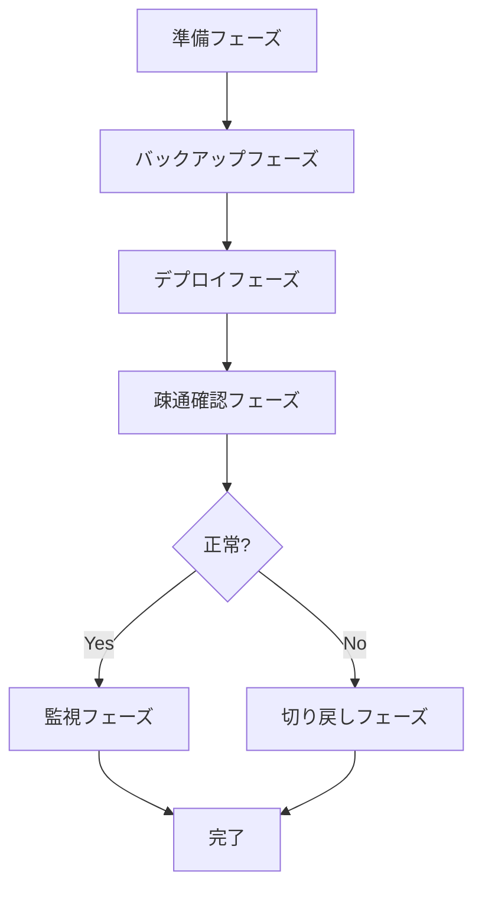

# リリース手順書テンプレート

## ドキュメント情報

| 項目 | 内容 |
|------|------|
| **リリースバージョン** | v[X.X.X] |
| **リリース予定日時** | YYYY/MM/DD HH:MM ~ HH:MM |
| **作業者** | [氏名] |
| **承認者** | [氏名] |
| **作成日** | YYYY/MM/DD |
| **最終更新日** | YYYY/MM/DD |

---

## 前提条件

### 作業環境

- [ ] VPN接続済み
- [ ] 本番環境アクセス権限あり
- [ ] 作業端末の準備完了
- [ ] 緊急連絡先を確認済み

### 必要なツール・認証情報

```bash
# 必要なツールのバージョン確認
kubectl version --client
aws --version
docker --version
```

- [ ] AWS CLIログイン済み
- [ ] Kubernetesクラスタ接続確認済み
- [ ] データベースアクセス確認済み

---

## リリース全体フロー



**所要時間目安**: 約2時間

---

## フェーズ1: 準備（30分）

### 1.1 関係者への連絡

**所要時間**: 5分

```markdown
# Slack #release-YYYYMMDD に投稿

@channel
【リリース作業開始】
バージョン: vX.X.X
予定時間: HH:MM ~ HH:MM
作業者: @username
```

- [ ] Slack投稿完了

### 1.2 現在の状態確認

**所要時間**: 10分

#### 【変化前】アプリケーションバージョン確認

```bash
# 現在のバージョンを確認
kubectl get deployment api-deployment -o jsonpath='{.spec.template.spec.containers[0].image}'
```

**期待値**: `api:v1.1.0`
**実際の値**: `______________________`

- [ ] バージョン確認完了

#### 【変化前】データベース接続確認

```bash
# データベース接続テスト
psql $DATABASE_URL -c "SELECT version();"
```

**期待値**: 接続成功
**実際の結果**: `______________________`

- [ ] DB接続確認完了

#### 【変化前】サービス稼働確認

```bash
# ヘルスチェック
curl -f https://api.example.com/health
```

**期待値**: `{"status":"ok"}`
**実際の結果**: `______________________`

- [ ] サービス稼働確認完了

### 1.3 メンテナンス告知

**所要時間**: 5分

- [ ] アプリ内通知掲示
- [ ] ステータスページ更新
- [ ] Slack通知送信

### 1.4 監視ダッシュボード準備

**所要時間**: 5分

以下のダッシュボードを開いておく:

- [ ] アプリケーション監視ダッシュボード
- [ ] インフラ監視ダッシュボード
- [ ] エラーログダッシュボード

### 1.5 緊急連絡先確認

- [ ] リリース責任者: [氏名] [電話番号]
- [ ] エスカレーション先: [氏名] [電話番号]
- [ ] インフラ担当: [氏名] [電話番号]

**チェックポイント**: すべての準備が完了していることを確認

---

## フェーズ2: バックアップ（20分）

### 2.1 データベースバックアップ

**所要時間**: 15分
**目的**: 万が一マイグレーションに失敗した場合にデータを復元するため

#### 【変化前】ディスク容量確認

```bash
# ディスク容量確認（バックアップ保存先）
df -h /backup
```

**期待値**: 10GB以上の空き容量
**実際の値**: `______________________`

- [ ] ディスク容量十分

#### 【変化】バックアップ取得

```bash
# データベースバックアップ取得
BACKUP_FILE="backup_$(date +%Y%m%d_%H%M%S).dump"
pg_dump -Fc -h <DB_HOST> -U <DB_USER> -d production > /backup/$BACKUP_FILE

# バックアップ取得完了時刻を記録
echo "バックアップ完了: $(date)"
```

**バックアップファイル名**: `______________________`
**完了時刻**: `______________________`

- [ ] バックアップ取得完了

#### 【変化後】バックアップ検証

```bash
# ファイルサイズ確認（0バイトでないこと）
ls -lh /backup/$BACKUP_FILE

# バックアップ内容確認
pg_restore --list /backup/$BACKUP_FILE | head -20
```

**ファイルサイズ**: `______________________`
**テーブル数**: `______________________`

- [ ] バックアップ検証完了

### 2.2 設定ファイルバックアップ

**所要時間**: 5分

```bash
# Kubernetes設定のバックアップ
kubectl get deployment api-deployment -o yaml > /backup/deployment_backup_$(date +%Y%m%d_%H%M%S).yaml

# ConfigMapのバックアップ
kubectl get configmap app-config -o yaml > /backup/configmap_backup_$(date +%Y%m%d_%H%M%S).yaml
```

- [ ] 設定ファイルバックアップ完了

**チェックポイント**: すべてのバックアップが正常に取得されていること

---

## フェーズ3: デプロイ（40分）

### 3.1 コンテナイメージビルド・プッシュ

**所要時間**: 10分

#### 【変化】イメージビルド

```bash
# Dockerイメージビルド
docker build -t api:vX.X.X .

# イメージサイズ確認
docker images api:vX.X.X
```

**イメージサイズ**: `______________________`

- [ ] イメージビルド完了

#### 【変化】イメージプッシュ

```bash
# コンテナレジストリにプッシュ
docker tag api:vX.X.X <REGISTRY>/api:vX.X.X
docker push <REGISTRY>/api:vX.X.X
```

- [ ] イメージプッシュ完了

### 3.2 データベースマイグレーション

**所要時間**: 15分
**注意**: この作業中はアプリケーションを停止すること

#### 【変化前】マイグレーション前の状態確認

```bash
# 現在のマイグレーションバージョン確認
psql $DATABASE_URL -c "SELECT version FROM schema_migrations ORDER BY version DESC LIMIT 5;"
```

**最新バージョン**: `______________________`

- [ ] マイグレーション前確認完了

#### 【変化】アプリケーション停止

```bash
# アプリケーションのレプリカ数を0に設定
kubectl scale deployment/api-deployment --replicas=0

# Pod停止確認
kubectl get pods -l app=api
```

**期待値**: `No resources found` または すべてのPodが `Terminating`
**実際の結果**: `______________________`

- [ ] アプリケーション停止完了

#### 【変化】マイグレーション実行

```bash
# マイグレーション実行
kubectl run migration-job --image=<REGISTRY>/api:vX.X.X --restart=Never \
  --env="DATABASE_URL=$DATABASE_URL" \
  --command -- bundle exec rails db:migrate

# ログ確認
kubectl logs migration-job -f
```

**期待値**: `Migrated successfully`
**実際の結果**: `______________________`

- [ ] マイグレーション完了

#### 【変化後】マイグレーション後の状態確認

```bash
# マイグレーション後のバージョン確認
psql $DATABASE_URL -c "SELECT version FROM schema_migrations ORDER BY version DESC LIMIT 5;"

# テーブル一覧確認
psql $DATABASE_URL -c "\dt"
```

**最新バージョン**: `______________________`
**追加されたテーブル**: `______________________`

- [ ] マイグレーション検証完了

### 3.3 アプリケーションデプロイ

**所要時間**: 15分

#### 【変化】デプロイ実行

```bash
# 新バージョンをデプロイ
kubectl set image deployment/api-deployment api=<REGISTRY>/api:vX.X.X

# ロールアウト状況確認
kubectl rollout status deployment/api-deployment
```

**期待値**: `deployment "api-deployment" successfully rolled out`
**実際の結果**: `______________________`

- [ ] デプロイ完了

#### 【変化後】Pod起動確認

```bash
# Pod状態確認
kubectl get pods -l app=api

# Pod詳細確認
kubectl describe pod -l app=api | grep -A 5 "Status:"
```

**期待値**: すべてのPodが `Running` かつ `Ready`
**実際の結果**: `______________________`

- [ ] Pod起動確認完了

#### 【変化後】バージョン確認

```bash
# デプロイされたバージョン確認
kubectl get deployment api-deployment -o jsonpath='{.spec.template.spec.containers[0].image}'
```

**期待値**: `<REGISTRY>/api:vX.X.X`
**実際の結果**: `______________________`

- [ ] バージョン確認完了

**チェックポイント**: デプロイが正常に完了していること

---

## フェーズ4: 疎通確認（30分）

### 4.1 ヘルスチェック

**所要時間**: 5分

#### 【変化後】APIヘルスチェック

```bash
# ヘルスチェックエンドポイント確認
curl -f https://api.example.com/health

# レスポンスタイム確認
time curl https://api.example.com/health
```

**期待値**: `{"status":"ok"}` かつ レスポンスタイム 3秒以内
**実際の結果**: `______________________`
**レスポンスタイム**: `______________________`

- [ ] ヘルスチェック成功

### 4.2 主要機能確認

**所要時間**: 20分

#### 4.2.1 ログイン機能

```bash
# ログインAPIテスト
curl -X POST https://api.example.com/auth/login \
  -H "Content-Type: application/json" \
  -d '{"email":"test@example.com","password":"test123"}'
```

**期待値**: トークンが返却される
**実際の結果**: `______________________`

- [ ] ログイン機能正常

#### 4.2.2 データ取得API

```bash
# ユーザー情報取得APIテスト
curl -H "Authorization: Bearer <TOKEN>" \
  https://api.example.com/users/1
```

**期待値**: ユーザー情報が返却される
**実際の結果**: `______________________`

- [ ] データ取得API正常

#### 4.2.3 データ登録API

```bash
# データ登録APIテスト
curl -X POST https://api.example.com/posts \
  -H "Authorization: Bearer <TOKEN>" \
  -H "Content-Type: application/json" \
  -d '{"title":"Test","body":"Test content"}'
```

**期待値**: 登録成功（201 Created）
**実際の結果**: `______________________`

- [ ] データ登録API正常

#### 4.2.4 新機能確認（該当する場合）

[新機能のテストケースを記載]

- [ ] 新機能正常

### 4.3 ログ・エラー確認

**所要時間**: 5分

```bash
# エラーログ確認（直近100行）
kubectl logs -l app=api --tail=100 | grep -i error

# アプリケーションログ確認
kubectl logs -l app=api --tail=50
```

**期待値**: クリティカルなエラーがないこと
**実際の結果**: `______________________`

- [ ] ログ確認完了
- [ ] エラーなし

**チェックポイント**: すべての主要機能が正常に動作していること

---

## フェーズ5: 監視（リリース後24時間）

### 5.1 リリース直後の監視（30分）

#### メトリクス確認

```bash
# エラーレート確認
# ダッシュボードURL: https://monitoring.example.com/errors

# レスポンスタイム確認
# ダッシュボードURL: https://monitoring.example.com/latency

# リソース使用率確認
kubectl top pods -l app=api
```

**確認時刻**: `______________________`

| 指標 | 正常範囲 | 実測値 | 判定 |
|------|---------|--------|------|
| エラーレート | 0.1%以下 | _____ % | [ ] |
| レスポンスタイム(p95) | 3秒以内 | _____ 秒 | [ ] |
| CPU使用率 | 80%以下 | _____ % | [ ] |
| メモリ使用率 | 80%以下 | _____ % | [ ] |

- [ ] すべて正常範囲内

#### ユーザー影響確認

- [ ] カスタマーサポートへの問い合わせ: _____ 件
- [ ] エラー報告: _____ 件
- [ ] 重大なクレーム: _____ 件

### 5.2 15分ごとの進捗報告

```markdown
# Slack #release-YYYYMMDD に投稿

HH:00 [開始] リリース作業開始
HH:15 [進行中] バックアップ完了（1/5）
HH:30 [進行中] マイグレーション完了（2/5）
HH:45 [進行中] デプロイ完了（3/5）
HH:60 [進行中] 疎通確認完了（4/5）
HH:75 [完了] リリース完了、監視継続中（5/5）
```

### 5.3 定期監視スケジュール

| 時刻 | 確認項目 | 担当者 | 完了 |
|------|---------|--------|------|
| リリース直後 | エラーレート・レスポンスタイム | 作業者 | [ ] |
| +30分 | 同上 + ユーザー影響 | 作業者 | [ ] |
| +1時間 | 同上 | 作業者 | [ ] |
| +3時間 | 同上 | オンコール | [ ] |
| +6時間 | 同上 | オンコール | [ ] |
| +24時間 | 同上 + データ整合性 | オンコール | [ ] |

---

## リリース完了報告

### リリース結果

- [ ] リリース成功
- [ ] リリース成功（軽微な問題あり）
- [ ] 切り戻し実施

### 完了時刻

- **リリース開始**: `______________________`
- **リリース完了**: `______________________`
- **所要時間**: `______________________`

### 発生した問題

[問題があれば記載]

### 関係者への報告

```markdown
# Slack #release-YYYYMMDD に投稿

@channel
【リリース完了】
バージョン: vX.X.X
完了時刻: HH:MM
結果: 成功
発生した問題: なし

主要機能の動作確認が完了しました。
引き続き24時間監視を継続します。
```

- [ ] Slack報告完了
- [ ] メール報告完了（必要に応じて）

---

## 切り戻し手順（緊急時のみ実施）

### 切り戻し判断基準

以下のいずれかに該当する場合、即座に切り戻しを実施:

- [ ] アプリケーションが起動しない
- [ ] ログイン機能が動作しない
- [ ] エラーレート10%超
- [ ] レスポンスタイムが通常の3倍超

### 切り戻し手順

**制限時間**: リリース開始から2時間以内

#### ステップ1: 切り戻し宣言

```markdown
# Slack #release-YYYYMMDD に投稿

@channel @here
【緊急】切り戻し開始
理由: [理由を記載]
```

- [ ] 切り戻し宣言完了

#### ステップ2: アプリケーション切り戻し

```bash
# 旧バージョンに戻す
kubectl set image deployment/api-deployment api=<REGISTRY>/api:v1.1.0

# ロールアウト確認
kubectl rollout status deployment/api-deployment
```

- [ ] アプリケーション切り戻し完了

#### ステップ3: データベース切り戻し

```bash
# アプリケーション停止
kubectl scale deployment/api-deployment --replicas=0

# バックアップから復元
pg_restore -d production /backup/$BACKUP_FILE

# マイグレーションロールバック
kubectl run rollback-job --image=<REGISTRY>/api:v1.1.0 --restart=Never \
  --env="DATABASE_URL=$DATABASE_URL" \
  --command -- bundle exec rails db:rollback STEP=1

# アプリケーション再起動
kubectl scale deployment/api-deployment --replicas=3
```

- [ ] データベース切り戻し完了

#### ステップ4: 動作確認

```bash
# ヘルスチェック
curl -f https://api.example.com/health

# ログイン機能確認
curl -X POST https://api.example.com/auth/login \
  -H "Content-Type: application/json" \
  -d '{"email":"test@example.com","password":"test123"}'
```

- [ ] 動作確認完了

#### ステップ5: 完了報告

```markdown
# Slack #release-YYYYMMDD に投稿

@channel
【切り戻し完了】
完了時刻: HH:MM
状態: 旧バージョンv1.1.0で稼働中
次のアクション: 原因調査・再計画
```

- [ ] 切り戻し完了報告

---

## 付録

### トラブルシューティング

#### 問題: Podが起動しない

```bash
# Pod状態確認
kubectl describe pod -l app=api

# イベント確認
kubectl get events --sort-by='.lastTimestamp'

# ログ確認
kubectl logs -l app=api --previous
```

#### 問題: データベース接続エラー

```bash
# 接続テスト
psql $DATABASE_URL -c "SELECT 1;"

# 接続数確認
psql $DATABASE_URL -c "SELECT count(*) FROM pg_stat_activity;"
```

#### 問題: エラーレート上昇

```bash
# エラーログ抽出
kubectl logs -l app=api --tail=1000 | grep ERROR > errors.log

# エラー集計
kubectl logs -l app=api --tail=1000 | grep ERROR | sort | uniq -c | sort -rn
```

---

**作成日**: YYYY/MM/DD
**最終更新**: YYYY/MM/DD
**バージョン**: 1.0
**テンプレート作成者**: Claude Code
