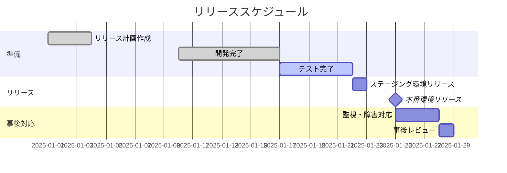
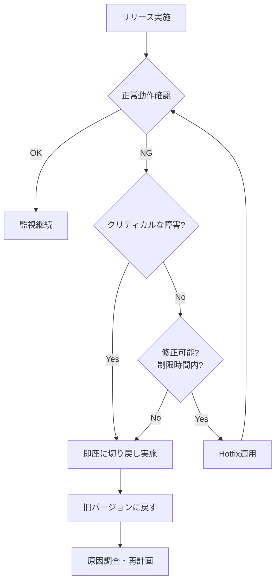

# リリース計画書

## ドキュメント情報

| 項目 | 内容 |
|------|------|
| **プロジェクト名** | [プロジェクト名を記入] |
| **リリースバージョン** | [例: v1.2.0] |
| **リリース予定日** | [YYYY/MM/DD HH:MM] |
| **作成日** | [YYYY/MM/DD] |
| **作成者** | [担当者名] |
| **最終更新日** | [YYYY/MM/DD] |
| **承認者** | [承認者名] |
| **ドキュメントバージョン** | 1.0 |

---

## 目次

1. [リリース概要](#1-リリース概要)
2. [リリース目的・背景](#2-リリース目的背景)
3. [リリース範囲](#3-リリース範囲)
4. [リリーススケジュール](#4-リリーススケジュール)
5. [リリース体制](#5-リリース体制)
6. [リリース判断基準](#6-リリース判断基準)
7. [リスク管理](#7-リスク管理)
8. [切り戻し計画](#8-切り戻し計画)
9. [コミュニケーション計画](#9-コミュニケーション計画)
10. [チェックリスト](#10-チェックリスト)
11. [添付資料](#11-添付資料)

---

## 1. リリース概要

### 1.1 リリース対象システム

| システム名 | 環境 | バージョン | URL |
|-----------|------|-----------|-----|
| [システム名] | 本番環境 | v1.2.0 | https://example.com |
| [APIサーバー] | 本番環境 | v1.2.0 | https://api.example.com |

### 1.2 リリース種別

- [ ] 定期リリース
- [ ] 緊急リリース
- [ ] パッチリリース
- [ ] メジャーバージョンアップ

### 1.3 影響範囲

- [ ] フロントエンド
- [ ] バックエンドAPI
- [ ] データベース（スキーマ変更あり/なし）
- [ ] インフラ構成変更
- [ ] 外部サービス連携
- [ ] その他: [記入]

---

## 2. リリース目的・背景

### 2.1 リリースの目的

**なぜこのリリースが必要なのか？**

[例]
- 新機能「ユーザー通知機能」の提供により、ユーザーエンゲージメント向上を図る
- セキュリティ脆弱性（CVE-2025-XXXX）への対応
- パフォーマンス改善による応答速度の50%向上

### 2.2 ビジネス上の価値

- ユーザーメリット: [記入]
- ビジネスメリット: [記入]
- 技術的メリット: [記入]

---

## 3. リリース範囲

### 3.1 機能追加

| # | 機能名 | 概要 | 優先度 | チケット番号 |
|---|--------|------|--------|-------------|
| 1 | ユーザー通知機能 | プッシュ通知・メール通知の実装 | 高 | PROJ-123 |
| 2 | ダッシュボード改善 | UIリニューアル | 中 | PROJ-124 |

### 3.2 バグ修正

| # | バグ内容 | 影響範囲 | 優先度 | チケット番号 |
|---|---------|---------|--------|-------------|
| 1 | ログイン時のタイムアウト | 全ユーザー | 高 | BUG-456 |
| 2 | CSVエクスポートの文字化け | 管理者のみ | 中 | BUG-457 |

### 3.3 技術的改善

| # | 改善内容 | 目的 | チケット番号 |
|---|---------|------|-------------|
| 1 | データベースインデックス追加 | クエリパフォーマンス改善 | TECH-789 |
| 2 | ライブラリアップデート | セキュリティ対応 | TECH-790 |

### 3.4 データベース変更

- [ ] スキーマ変更あり
  - テーブル追加: [テーブル名]
  - カラム追加: [テーブル名.カラム名]
  - インデックス追加: [詳細]
- [ ] マスタデータ変更あり
- [ ] マイグレーションスクリプト: [ファイル名]

---

## 4. リリーススケジュール

### 4.1 全体スケジュール



### 4.2 詳細スケジュール

| フェーズ | 日時 | 作業内容 | 担当者 | 完了 |
|---------|------|---------|--------|------|
| **準備フェーズ** | | | | |
| コードフリーズ | YYYY/MM/DD 17:00 | mainブランチへのマージ停止 | 開発リーダー | [ ] |
| ステージング環境デプロイ | YYYY/MM/DD 10:00 | ステージング環境へのリリース | インフラ担当 | [ ] |
| 最終動作確認 | YYYY/MM/DD 14:00 | シナリオテスト実施 | QA担当 | [ ] |
| リリース判定会議 | YYYY/MM/DD 16:00 | Go/No-Go判断 | PM | [ ] |
| **リリースフェーズ** | | | | |
| メンテナンス告知 | YYYY/MM/DD 19:00 | ユーザーへ事前通知 | 運用担当 | [ ] |
| データベースバックアップ | YYYY/MM/DD 20:00 | 本番DBバックアップ取得 | DBA | [ ] |
| 本番環境デプロイ | YYYY/MM/DD 21:00 | 本番環境リリース | インフラ担当 | [ ] |
| DBマイグレーション | YYYY/MM/DD 21:15 | スキーマ変更適用 | DBA | [ ] |
| 疎通確認 | YYYY/MM/DD 21:30 | ヘルスチェック実施 | 開発担当 | [ ] |
| リリース完了通知 | YYYY/MM/DD 22:00 | 関係者へ完了報告 | PM | [ ] |
| **事後フェーズ** | | | | |
| 監視強化期間 | YYYY/MM/DD 22:00 ~ 翌3日間 | エラー監視、パフォーマンス監視 | 運用担当 | [ ] |
| 事後レビュー | YYYY/MM/DD +3日 | 振り返り会実施 | 全員 | [ ] |

---

## 5. リリース体制

### 5.1 役割分担

| 役割 | 氏名 | 連絡先 | 責任範囲 |
|------|------|--------|---------|
| **リリース責任者** | [氏名] | [電話/Slack] | リリース全体の統括、最終判断 |
| **リリース作業者** | [氏名] | [電話/Slack] | デプロイ作業実施 |
| **データベース担当** | [氏名] | [電話/Slack] | DBマイグレーション、バックアップ |
| **インフラ担当** | [氏名] | [電話/Slack] | サーバー監視、ネットワーク確認 |
| **アプリケーション担当** | [氏名] | [電話/Slack] | 動作確認、障害対応 |
| **QA担当** | [氏名] | [電話/Slack] | テストシナリオ実施 |
| **カスタマーサポート** | [氏名] | [電話/Slack] | ユーザー問い合わせ対応 |

### 5.2 意思決定者

| 判断事項 | 意思決定者 | エスカレーション先 |
|---------|-----------|------------------|
| リリース実施可否（Go/No-Go） | リリース責任者 | プロダクトオーナー |
| 切り戻し判断 | リリース責任者 | CTO |
| リリース延期判断 | プロダクトオーナー | 経営層 |

### 5.3 コミュニケーションチャネル

- **リリース当日**: Slack #release-YYYYMMDD（専用チャンネル作成）
- **緊急連絡**: 電話・SMS
- **進捗報告**: Slack #release-YYYYMMDD に15分ごと

---

## 6. リリース判断基準

### 6.1 リリース実施条件（Go条件）

すべての条件を満たすこと:

- [ ] すべてのテストケースが合格している
- [ ] クリティカルな既知の不具合が存在しない
- [ ] ステージング環境で正常動作が確認されている
- [ ] データベースバックアップが正常に取得されている
- [ ] 切り戻し手順が確認されている
- [ ] 全関係者がリリース準備完了を報告している
- [ ] メンテナンス告知が完了している

### 6.2 リリース中止条件（No-Go条件）

以下のいずれかに該当する場合、リリースを中止:

- [ ] クリティカルなバグが発見された（Severity 1）
- [ ] ステージング環境で再現性のある障害が発生している
- [ ] データベースバックアップが取得できない
- [ ] インフラ障害が発生している
- [ ] 外部サービス（決済、認証等）に障害が発生している
- [ ] 重要な関係者が不在で連絡が取れない

### 6.3 切り戻し判断基準

以下のいずれかに該当する場合、即座に切り戻しを検討:

- [ ] 本番環境でアプリケーションが起動しない
- [ ] 主要機能（ログイン、決済等）が動作しない
- [ ] エラーレートが通常の10倍を超える
- [ ] レスポンスタイムが通常の3倍を超える
- [ ] データ不整合が発生している
- [ ] セキュリティインシデントが発生している

**切り戻し制限時間**: リリース開始から **2時間以内** に切り戻し判断を完了すること

---

## 7. リスク管理

### 7.1 想定リスクと対策

| # | リスク内容 | 発生確率 | 影響度 | 対策 | 担当者 |
|---|-----------|---------|--------|------|--------|
| 1 | データベースマイグレーション失敗 | 中 | 高 | 事前にステージング環境で実施、ロールバックスクリプト準備 | DBA |
| 2 | デプロイ中のサーバーダウン | 低 | 高 | Blue-Greenデプロイ採用、ヘルスチェック自動化 | インフラ |
| 3 | 外部API連携エラー | 中 | 中 | リトライ機能実装、タイムアウト設定 | 開発 |
| 4 | パフォーマンス劣化 | 中 | 中 | 負荷テスト実施、APM監視強化 | 開発 |
| 5 | ユーザー問い合わせ急増 | 高 | 低 | FAQドキュメント準備、サポート体制強化 | CS |

### 7.2 既知の制約事項

| # | 制約内容 | 回避策 |
|---|---------|--------|
| 1 | リリース時間帯はアクセスが多い | 深夜時間帯にリリース実施 |
| 2 | データベースマイグレーションに10分程度かかる | メンテナンスウィンドウ確保 |

---

## 8. 切り戻し計画

### 8.1 切り戻し判断フロー



### 8.2 切り戻し手順

**切り戻し制限時間**: リリース開始から **2時間以内**

#### ステップ1: 切り戻し判断

1. リリース責任者が切り戻し判断基準に基づき決定
2. Slack #release-YYYYMMDDに「**切り戻し開始**」を宣言
3. 全関係者に電話で緊急連絡

#### ステップ2: アプリケーション切り戻し

```bash
# 1. 旧バージョンのコンテナイメージに切り替え
kubectl set image deployment/app-deployment app=app:v1.1.0

# 2. ロールアウト状況確認
kubectl rollout status deployment/app-deployment

# 3. ヘルスチェック
curl https://api.example.com/health
```

#### ステップ3: データベース切り戻し

```bash
# 1. アプリケーションを停止
kubectl scale deployment/app-deployment --replicas=0

# 2. データベースバックアップから復元
pg_restore -d production backup_20250125_2000.dump

# 3. マイグレーション前の状態に戻す
bundle exec rails db:rollback STEP=1

# 4. アプリケーション再起動
kubectl scale deployment/app-deployment --replicas=3
```

#### ステップ4: 動作確認

- [ ] ヘルスチェックエンドポイント確認
- [ ] ログイン機能確認
- [ ] 主要API動作確認
- [ ] エラーログ確認

#### ステップ5: 完了報告

- Slack #release-YYYYMMDDに「**切り戻し完了**」を報告
- ユーザーへ障害復旧通知

### 8.3 データ整合性確認

切り戻し後、以下のデータ整合性を確認:

- [ ] リリース中に登録されたデータが失われていないか
- [ ] トランザクションが中断されていないか
- [ ] 外部サービス連携データに不整合がないか

---

## 9. コミュニケーション計画

### 9.1 事前告知

| 対象 | 告知内容 | 告知日時 | 担当者 |
|------|---------|---------|--------|
| 全ユーザー | メンテナンス通知（アプリ内・メール） | リリース3日前 | CS |
| 重要顧客 | 個別連絡（メール・電話） | リリース1週間前 | 営業 |
| 社内関係者 | リリース内容・スケジュール共有 | リリース1週間前 | PM |

### 9.2 当日コミュニケーション

| タイミング | 報告内容 | 報告先 | 担当者 |
|-----------|---------|--------|--------|
| リリース開始時 | 作業開始宣言 | Slack #release | リリース責任者 |
| 各フェーズ完了時 | 進捗報告 | Slack #release | 各作業者 |
| リリース完了時 | 完了報告 | 全関係者 | リリース責任者 |
| 障害発生時 | 即座に報告 | 全関係者・経営層 | リリース責任者 |

### 9.3 事後報告

- リリース完了報告（成功/失敗）
- KPI達成状況
- 発生した問題と対応
- 改善提案

---

## 10. チェックリスト

### 10.1 リリース準備チェックリスト

#### 開発・テスト

- [ ] すべてのコードレビューが完了している
- [ ] 単体テストがすべて合格している
- [ ] 結合テストがすべて合格している
- [ ] E2Eテストがすべて合格している
- [ ] パフォーマンステストが合格している（該当する場合）
- [ ] セキュリティスキャンが完了している
- [ ] アクセシビリティチェックが完了している（該当する場合）

#### ドキュメント

- [ ] リリースノートが作成されている
- [ ] API仕様書が更新されている
- [ ] ユーザーマニュアルが更新されている
- [ ] 運用マニュアルが更新されている
- [ ] リリース手順書が作成されている
- [ ] 切り戻し手順書が作成されている

#### インフラ

- [ ] ステージング環境が本番環境と同一構成である
- [ ] データベースバックアップが取得されている
- [ ] コンテナイメージがビルドされている
- [ ] 環境変数が設定されている
- [ ] SSL証明書が有効である
- [ ] DNSレコードが正しく設定されている

#### 監視・ログ

- [ ] アプリケーション監視が設定されている
- [ ] インフラ監視が設定されている
- [ ] アラート設定が有効である
- [ ] ログ収集が有効である
- [ ] ダッシュボードが準備されている

#### 外部サービス

- [ ] 外部API連携テストが完了している
- [ ] 決済サービス連携確認が完了している（該当する場合）
- [ ] メール送信テストが完了している
- [ ] プッシュ通知テストが完了している（該当する場合）

### 10.2 リリース当日チェックリスト

#### リリース前（2時間前）

- [ ] リリース責任者・作業者全員が参加可能であることを確認
- [ ] 緊急連絡先が共有されている
- [ ] Slackチャンネルが作成されている
- [ ] データベースバックアップが最新である
- [ ] ステージング環境で最終動作確認が完了している

#### リリース前（1時間前）

- [ ] メンテナンス告知が掲示されている
- [ ] サーバーリソース（CPU/メモリ/ディスク）が十分である
- [ ] 外部サービスが正常稼働している
- [ ] リリース作業用の権限が付与されている

#### リリース中

- [ ] コードフリーズが実施されている
- [ ] データベースバックアップが完了している
- [ ] アプリケーションデプロイが完了している
- [ ] データベースマイグレーションが完了している
- [ ] ヘルスチェックが正常である
- [ ] 主要機能の疎通確認が完了している

#### リリース後（直後）

- [ ] エラーログに異常がない
- [ ] レスポンスタイムが正常範囲である
- [ ] ユーザーからの問い合わせがない
- [ ] リリース完了通知が送信されている

#### リリース後（24時間）

- [ ] エラーレートが通常範囲である
- [ ] パフォーマンス指標が正常である
- [ ] ユーザーからのクレームがない
- [ ] データ整合性に問題がない

### 10.3 事後対応チェックリスト

- [ ] 監視ダッシュボードを定期的に確認（1週間）
- [ ] ユーザーフィードバックを収集
- [ ] 発生した問題をチケット化
- [ ] リリース振り返り会議を実施
- [ ] リリース手順書を改善
- [ ] ナレッジベースを更新

---

## 11. 添付資料

### 11.1 関連ドキュメント

| ドキュメント名 | 格納場所 | 説明 |
|--------------|---------|------|
| リリース手順書 | `/docs/release/release_procedure_vX.X.X.md` | 詳細な作業手順 |
| テスト結果報告書 | `/docs/test/test_report_vX.X.X.md` | テスト結果サマリ |
| データベース変更履歴 | `/db/migrations/` | マイグレーションスクリプト |
| リリースノート | `/CHANGELOG.md` | ユーザー向け変更内容 |

### 11.2 ツール・環境情報

| 項目 | 情報 |
|------|------|
| CI/CDツール | GitHub Actions / GitLab CI / Jenkins |
| コンテナレジストリ | Docker Hub / ECR / GCR |
| デプロイツール | Kubernetes / AWS ECS / Heroku |
| 監視ツール | Datadog / New Relic / CloudWatch |
| ログ管理 | Elasticsearch / Splunk / CloudWatch Logs |

### 11.3 連絡先リスト

| 役割 | 氏名 | 電話番号 | メールアドレス | Slack |
|------|------|---------|---------------|-------|
| リリース責任者 | [氏名] | [電話] | [メール] | @username |
| エスカレーション先 | [氏名] | [電話] | [メール] | @username |

---

## リリース計画作成のベストプラクティス

### 1. **早めに作成を開始する**
リリース2〜4週間前から計画を作成し始め、徐々に詳細化していく

### 2. **切り戻し計画を最優先で作成する**
「何か問題が発生した時の切り戻しの計画」が最も重要

### 3. **1ステップ = 1アクション**
コピー＆ペーストで実行できるレベルまで詳細化する

### 4. **意思決定者を明確化する**
誰が何を判断するのかを事前に決定し、迷いをなくす

### 5. **図を活用する**
フロー図、ガントチャート、アーキテクチャ図などで認識のズレを防ぐ

### 6. **継続的に改善する**
リリース後の振り返りでドキュメントを改善し、次回に活かす

### 7. **属人化を防ぐ**
Markdown + Git管理で、誰でもアクセス・編集可能にする

### 8. **テンプレート化する**
定型業務はテンプレート化し、毎回ゼロから作成しない

---

## 変更履歴

| バージョン | 日付 | 変更内容 | 変更者 |
|-----------|------|---------|--------|
| 1.0 | YYYY/MM/DD | 初版作成 | [氏名] |

---

**最終更新日**: 2025年12月
**ドキュメントバージョン**: 1.0
**テンプレート作成者**: Claude Code
